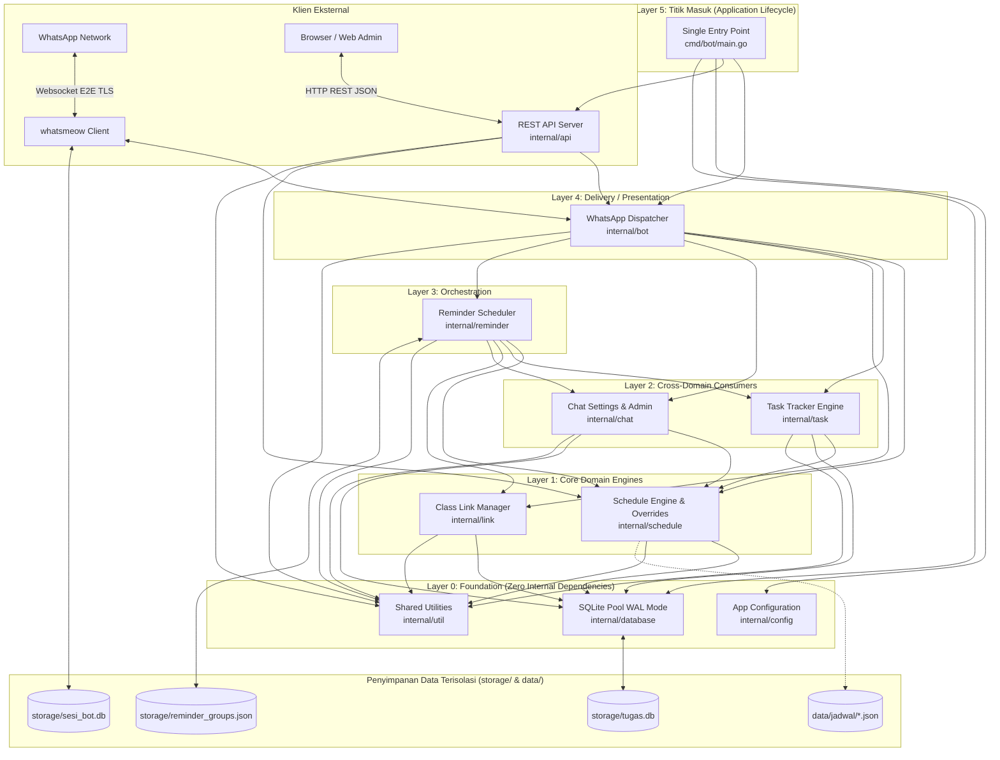

# 🏗️ Arsitektur Sistem & Panduan Pengembang (*Architecture & Maintainer Guide*)

Dokumen ini ditujukan bagi pengembang (*maintainer / contributor*) untuk memahami arsitektur internal, struktur modularitas, skema basis data, kehandalan konkurensi, alur pemrosesan pesan, dan panduan penambahan fitur pada **Bot WhatsApp Jadwal Kuliah & Manajemen Tugas**.

---

## 1. 🌐 Arsitektur Tingkat Tinggi (*High-Level Architecture*)

Aplikasi dibangun menggunakan **Go (Golang)** dengan pola modular berbobot ringan (*monolithic lightweight service*) berbasis **Pure Go** (bebas dependensi CGO/GCC). Hal ini memungkinkan kompilasi lintas platform yang sangat cepat dan distribusi biner tunggal (*single binary*).



---

## 2. 📂 Peta Direktori & Tanggung Jawab Modul (*Module Directory Map*)

Arsitektur sistem mengadopsi **Standard Go Project Layout** yang modular di bawah `cmd/` dan `internal/` dengan hirarki dependensi satu arah (*Directed Acyclic Graph / DAG*):

| Paket / Direktori | Tanggung Jawab Utama | Rangkaian Uji Terkait |
| :--- | :--- | :--- |
| [cmd/bot/main.go](file:///f:/Project/bot-jadwal/cmd/bot/main.go) | **Single Entry Point**: Titik masuk tunggal aplikasi, membaca konfigurasi, inisialisasi dependency injection, menjalankan bot WhatsApp dan HTTP REST server, serta menangani *graceful shutdown*. | Integration / Build |
| [internal/config/](file:///f:/Project/bot-jadwal/internal/config/) | **Konfigurasi & Auto-Migration**: Mengelola path database, port API, dan memindahkan secara otomatis berkas runtime lama (`tugas.db*`, `sesi_bot.db*`) ke direktori `storage/`. | [config_test.go](file:///f:/Project/bot-jadwal/internal/config/config_test.go) |
| [internal/database/](file:///f:/Project/bot-jadwal/internal/database/) | **Unified SQLite Pool (`InitDB`)**: Inisialisasi pool SQLite bersama dengan mode WAL (`journal_mode=WAL`), `busy_timeout=5000`, dan `foreign_keys=1`. | [db_test.go](file:///f:/Project/bot-jadwal/internal/database/db_test.go) |
| [internal/util/](file:///f:/Project/bot-jadwal/internal/util/) | **Shared Pure Helpers**: Lokalisasi waktu WIB, parser tanggal alami, pembersih prefix perintah, dan resolver jalur data otomatis (`FindDataDir`). | [utils_test.go](file:///f:/Project/bot-jadwal/internal/util/utils_test.go) |
| [internal/schedule/](file:///f:/Project/bot-jadwal/internal/schedule/) | **Schedule & Override Domain**: Mengelola kurikulum multi-kelas (`ClassManager`), evaluasi jam aktif, pencarian matkul, serta pengelola jadwal pengganti sementara (`OverrideManager`). | `*_test.go` di `internal/schedule` |
| [internal/task/](file:///f:/Project/bot-jadwal/internal/task/) | **Task Management Domain**: CRUD catatan tugas SQLite (`tasks`), validasi mata kuliah resmi kurikulum, filter tugas, dan badge urgensi deadline. | [task_test.go](file:///f:/Project/bot-jadwal/internal/task/task_test.go) |
| [internal/link/](file:///f:/Project/bot-jadwal/internal/link/) | **Class Link Domain**: CRUD tautan penting kelas (`class_links`), normalisasi HTTPS, dan tagging kategori cerdas (`drive`, `meeting`, dll). | [link_test.go](file:///f:/Project/bot-jadwal/internal/link/link_test.go) |
| [internal/chat/](file:///f:/Project/bot-jadwal/internal/chat/) | **Chat Binding & Admin Resolution**: Pengaturan preferensi kelas per grup (`ChatSettingsManager`) dan deteksi admin grup dengan caching in-memory 3 menit (`GroupAdminResolver`). | `*_test.go` di `internal/chat` |
| [internal/reminder/](file:///f:/Project/bot-jadwal/internal/reminder/) | **Broadcast Orchestration**: Scheduler latar belakang pengingat pagi (06:00 WIB), integrasi ringkasan jadwal per kelas, tugas mendesak, dan link daring. | [reminder_test.go](file:///f:/Project/bot-jadwal/internal/reminder/reminder_test.go) |
| [internal/bot/](file:///f:/Project/bot-jadwal/internal/bot/) | **WhatsApp Presentation Layer**: Lifecycle whatsmeow (`BotClient`), auto-reconnect watchdog, quoted reply, dan message event dispatcher. | [reply_test.go](file:///f:/Project/bot-jadwal/internal/bot/reply_test.go) |
| [internal/api/](file:///f:/Project/bot-jadwal/internal/api/) | **Web Admin REST API**: HTTP server net/http dengan CORS middleware, graceful shutdown, endpoint `/api/health` dan `/api/status`. | [server_test.go](file:///f:/Project/bot-jadwal/internal/api/server_test.go) |
| `storage/` | **Isolated Runtime Storage**: Direktori khusus untuk state dinamis (`tugas.db`, `sesi_bot.db`, `reminder_groups.json`) yang diabaikan oleh Git. | System / Runtime |

---

## 3. 🗄️ Skema Basis Data & Pola Persistensi

### A. Tabel `tasks` (Database: `tugas.db`)
Menyimpan seluruh catatan tugas kelas (lingkup grup) maupun catatan tugas mandiri (lingkup DM pribadi):

```sql
CREATE TABLE IF NOT EXISTS tasks (
    id INTEGER PRIMARY KEY AUTOINCREMENT,
    scope_jid TEXT NOT NULL,          -- JID grup (cth: 120363xxx@g.us) atau JID user (cth: 62812xxx@s.whatsapp.net)
    is_group BOOLEAN NOT NULL,         -- 1 jika di grup kelas, 0 jika di DM pribadi
    matkul TEXT NOT NULL,             -- Nama resmi matkul (cth: SISTEM BASIS DATA)
    deskripsi TEXT NOT NULL,          -- Detail instruksi / deskripsi tugas
    deadline TEXT NOT NULL,           -- Label teks tenggat seragam (cth: "Jumat, 11 Sep 23:59 WIB")
    deadline_at DATETIME,             -- Timestamp UTC/Local untuk sorting dan kalkulasi badge urgensi
    created_by TEXT NOT NULL,         -- JID pengguna yang membuat catatan tugas
    is_done BOOLEAN DEFAULT 0,        -- 0 = aktif, 1 = selesai (diarsipkan ke riwayat)
    created_at DATETIME DEFAULT CURRENT_TIMESTAMP
);
CREATE INDEX IF NOT EXISTS idx_tasks_scope ON tasks(scope_jid, is_done);
```

### B. Tabel `schedule_overrides` (Database: `tugas.db`)
Menyimpan perubahan jadwal perkuliahan yang hanya berlaku mengikat pada tanggal spesifik (*Date-Specific Override*):

```sql
CREATE TABLE IF NOT EXISTS schedule_overrides (
    id INTEGER PRIMARY KEY AUTOINCREMENT,
    scope_jid TEXT NOT NULL,          -- JID grup kelas
    override_type TEXT NOT NULL,      -- RESCHEDULE, CANCEL, EXTRA, HOLIDAY
    kode_matkul TEXT NOT NULL,        -- Kode matkul kurikulum (atau "LIBUR")
    nama_matkul TEXT NOT NULL,        -- Nama mata kuliah (atau nama libur)
    dosen TEXT NOT NULL,              -- Nama pengajar
    inisial_dosen TEXT NOT NULL,      -- Inisial pengajar
    orig_date TEXT NOT NULL,          -- YYYY-MM-DD tanggal asal jadwal normal
    orig_jam TEXT NOT NULL,           -- Jam asal (cth: "07:00 - 08:40")
    target_date TEXT NOT NULL,        -- YYYY-MM-DD tanggal berlakunya perubahan
    new_jam TEXT NOT NULL,            -- Jam baru (cth: "13:00 - 14:40")
    ruang TEXT NOT NULL,              -- Ruangan baru
    alasan TEXT NOT NULL,             -- Keterangan / alasan pergeseran
    created_by TEXT NOT NULL,         -- JID Komti / Admin yang memodifikasi
    created_at DATETIME DEFAULT CURRENT_TIMESTAMP
);
CREATE INDEX IF NOT EXISTS idx_overrides_scope ON schedule_overrides(scope_jid, target_date);
```

### C. Tabel `chat_settings` (Database: `tugas.db`)
Menyimpan binding relasi antara grup WhatsApp / chat pribadi terhadap jadwal kelas tertentu (*Multi-Tenant Support*):

```sql
CREATE TABLE IF NOT EXISTS chat_settings (
    scope_jid TEXT PRIMARY KEY,       -- JID grup (120363xxx@g.us) atau JID user
    class_id TEXT NOT NULL,           -- ID kelas huruf kapital (contoh: "3A", "3B")
    updated_at DATETIME DEFAULT CURRENT_TIMESTAMP
);
```

### D. Tabel `class_links` (Database: `tugas.db`)
Menyimpan daftar tautan penting kelas (Google Drive, Zoom, Google Meet, GitHub, portal kampus):

```sql
CREATE TABLE IF NOT EXISTS class_links (
    id INTEGER PRIMARY KEY AUTOINCREMENT,
    scope_jid TEXT NOT NULL,          -- JID grup atau DM pribadi
    is_group BOOLEAN NOT NULL,         -- 1 jika di grup, 0 jika di DM
    title TEXT NOT NULL,              -- Judul tautan (cth: "Drive Materi Kuliah")
    url TEXT NOT NULL,                -- URL tujuan (diawali http:// atau https://)
    category TEXT NOT NULL DEFAULT 'umum', -- "drive", "meeting", "repo", "portal", "umum"
    description TEXT DEFAULT '',      -- Catatan tambahan / passcode
    created_by TEXT NOT NULL,         -- JID pembuat catatan tautan
    created_at DATETIME DEFAULT CURRENT_TIMESTAMP
);
CREATE INDEX IF NOT EXISTS idx_links_scope ON class_links(scope_jid);
```

### E. File Konfigurasi & Master Data

#### 1. Direktori Master Jadwal `data/jadwal/*.json`
Menyimpan master data kurikulum modular per kelas (misal: `data/jadwal/3a.json`, `data/jadwal/3b.json`). Format berkas mempertahankan schema `JadwalConfig`: kampus, daftar dosen, kode matkul, dan jadwal perkuliahan. Bot juga mendukung *fallback* membaca `jadwal.json` di root jika direktori belum dibuat.

#### 2. `reminder_groups.json`
Menyimpan konfigurasi pengingat otomatis dan daftar grup penerima:
```json
{
  "hour": 6,
  "minute": 30,
  "groups": [
    {
      "jid": "120363001234567890@g.us",
      "name": "D4 Teknik Informatika 3A",
      "added_at": "2026-09-04T08:00:00Z"
    }
  ]
}
```

---

## 4. ⚡ Manajemen Konkurensi & Kehandalan (*Reliability & Concurrency*)

### A. Shared SQLite Connection Pool ([db.go](file:///f:/Project/bot-jadwal/db.go))
* **Masalah Lama:** SQLite di Windows rentan memunculkan error `database is locked` jika terdapat lebih dari satu connection pool yang mengakses file fisik yang sama.
* **Solusi Terpadu:** Modul [db.go](file:///f:/Project/bot-jadwal/db.go) menginisialisasi satu instance `*sql.DB` bersama (`InitDB`) dan menginjeksinya ke `TaskManager` dan `OverrideManager`.
* **Parameter PRAGMA Optimal:**
  * `journal_mode=WAL`: Mengizinkan pembaca (*readers*) dan satu penulis (*writer*) bekerja bersamaan tanpa saling memblokir.
  * `busy_timeout=5000`: Menunggu hingga 5.000 ms jika ada proses tulis sebelum mengembalikan error.
  * `synchronous=NORMAL`: Kecepatan operasi disk optimal tanpa mengorbankan durabilitas data WAL.

### B. Auto-Reconnect Watchdog Supervisor
Koneksi websocket kampus/kosan rentan mengalami *EOF/RST*. Bot dilengkapi supervisor latar belakang di [main.go](file:///f:/Project/bot-jadwal/main.go):
* Memantau status `client.IsConnected()` secara berkala.
* Menerapkan **Exponential Backoff** (3s ➔ 6s ➔ 12s ➔ maks 30s) untuk menghindari *spamming reconnection*.

### C. Graceful Shutdown Terstruktur
Saat menerima sinyal terminasi (`Ctrl + C` / `SIGTERM`), bot mengeksekusi urutan pembersihan berjenjang:
1. Membatalkan konteks goroutine watchdog supervisor.
2. Memutuskan koneksi WhatsApp klien secara teratur (`client.Disconnect()`).
3. Menutup koneksi database aplikasi (`appDB.Close()`) untuk melakukan sinkronisasi (*checkpoint*) file WAL SQLite.
4. Menutup koneksi database sesi bot (`container.Close()`).

### D. Asynchronous Non-Blocking Message Dispatcher
* **Masalah Antrean (Blocking Sleep):** Tiap balasan bot melakukan simulasi mengetik (`time.Sleep(600ms)`). Pada event loop serial, pesan berikutnya terpaksa antre.
* **Solusi Konkurensi:** Pesan masuk didispatch ke goroutine terpisah (`go handleIncomingMessage(...)`) dengan proteksi *panic recovery* lokal (`defer func() { recover() }`). Bot dapat merespons puluhan chat secara paralel tanpa saling mengunci.

### E. Quoted Reply Message Builder (Preservasi Konteks Pesan)
Balasan bot menyematkan kutipan pesan pengguna (`waE2E.ExtendedTextMessage` dengan `ContextInfo` berisi `StanzaID`, `Participant` untuk grup, dan `QuotedMessage`), memastikan balasan tidak terpisah di grup yang sedang ramai mengobrol.

### F. Multi-Identifier Group Admin Resolver ([group_admin.go](file:///f:/Project/bot-jadwal/group_admin.go))
Arsitektur WhatsApp modern merutekan pesan grup menggunakan 15 digit **LID** (`@lid`) selain nomor telepon standar (`@s.whatsapp.net`). `GroupAdminResolver` memverifikasi hak admin melalui:
* Pencocokan Phone Number JID (`p.JID.User == senderJID.User`)
* Pencocokan LID WhatsApp (`p.LID.User == senderJID.User`)
* Pencocokan Alternate Sender (`v.Info.SenderAlt`)
* Resolusi `store.LIDStore` bawaan whatsmeow
* In-memory cache TTL 3 menit dengan auto-invalidation pada event `*events.GroupInfo`

---

## 5. 🔐 Otorisasi & Hak Akses Berbasis Lingkup (*Role & Scope-Based Authorization*)

Bot menerapkan pemisahan hak akses yang ketat untuk menjaga integritas data kelas:

| Lingkup Obrolan | Tipe Perintah | Hak Akses | Logika Verifikasi |
| :--- | :--- | :--- | :--- |
| **Grup Kelas (`@g.us`)** | Modifikasi Jadwal (`!pindah`, `!kosong`, `!kuliahganti`, `!libur`, `!batalganti`) | **Khusus Admin Grup** | Diverifikasi via `GroupAdminResolver` dengan pencocokan multi-identitas (Phone Number, WhatsApp LID, dan SenderAlt). |
| **Grup Kelas (`@g.us`)** | Modifikasi Tugas (`!tugas tambah`, `!tugas hapus`, `!tugas edit`, `!tugas selesai`) | **Khusus Admin Grup** | Melindungi catatan tugas kelas dari manipulasi anggota biasa. |
| **Grup Kelas (`@g.us`)** | Modifikasi Tautan (`!link tambah`, `!link hapus`) | **Khusus Admin Grup** | Mencegah penyisipan tautan berbahaya atau phising oleh anggota non-admin. |
| **Grup Kelas (`@g.us`)** | Pengaturan Kelas & Pengingat (`!setkelas`, `!resetkelas`, `!reminder on/off`) | **Khusus Admin Grup** | Menjaga stabilitas identitas kelas dan jadwal siaran grup. |
| **Grup Kelas (`@g.us`)** | Pembacaan (`!menu`, `!hari ini`, `!tugas`, `!link`, `!drive`, `!zoom`, `!next`, dll.) | **Semua Anggota** | Terbuka bebas untuk seluruh mahasiswa dalam grup. |
| **Chat Pribadi (`@s.whatsapp.net`)** | Semua Perintah | **Bebas (Pribadi)** | Setiap nomor WhatsApp otomatis menjadi admin untuk database tugas dan tautan pribadinya sendiri (*Isolated Scope*). |

---

## 6. 🔄 Siklus Pemrosesan Pesan (*Message Processing Lifecycle*)

```
[Pesan Masuk WhatsApp]
       │
       ▼
1. Filter Awal (Abaikan jika v.Info.IsFromMe == true)
       │
       ▼
2. Ekstraksi Teks (Conversation / ExtendedTextMessage)
       │
       ▼
3. Pembersihan Awalan (cleanCommandPrefix: hapus '!', '/', atau '#')
       │
       ▼
4. Dispatching Handler:
   ├── Prefix 'reminder'       ──► ReminderManager
   ├── Prefix 'tugas'          ──► TaskManager.HandleCommand(...)
   ├── Prefix 'pindah/kosong/
   │          libur/override'  ──► OverrideManager.HandleCommand(...)
   └── Perintah Jadwal Reguler ──► JadwalConfig.ProcessMessage(...)
       │
       ▼
5. Eksekusi Balasan Terpadu via replyWithTyping(...)
   ├── Berikan Emoji Reaction pada pesan pengguna (cth: ⏰, 📝, 🔄, 📅)
   ├── Kirim Chat Presence "Sedang Mengetik..." (Composing -> Sleep -> Paused)
   └── Kirim Pesan Balasan via client.SendMessage & Catat Log Konsol
```

---

## 7. 🛠️ Panduan Menambahkan Perintah Baru (*How to Add a Command*)

Untuk menambahkan perintah baru (misal: `!link` untuk direktori link Google Meet / Drive materi kuliah):

### Langkah 1: Implementasikan Handler di Modul Terkait
Tambahkan fungsi penanganan pada modul yang sesuai, misalnya di [schedule.go](file:///f:/Project/bot-jadwal/schedule.go):
```go
// GetClassLinks mengembalikan direktori tautan perkuliahan
func (j *JadwalConfig) GetClassLinks() string {
    return "🔗 *DIREKTORI TAUTAN KELAS*\n• Google Drive: https://bit.ly/drive-kelas\n• Grup Pengumuman: ..."
}
```

### Langkah 2: Daftarkan Perintah pada Parser Pesan
Pada method `ProcessMessage` di [schedule.go](file:///f:/Project/bot-jadwal/schedule.go), tambahkan percabangan:
```go
case "link", "drive", "tautan":
    return j.GetClassLinks()
```

### Langkah 3: Daftarkan di Kamus Bantuan & Menu
Tambahkan kata kunci pada method `GetKeywords()` dan format template di `GetMenu()` agar mahasiswa dapat menemukan perintah tersebut.

### Langkah 4: Buat Unit Test Otomatis
Buka berkas uji terkait (misal [schedule_test.go](file:///f:/Project/bot-jadwal/schedule_test.go)) dan tambahkan skenario validasi:
```go
reply := cfg.ProcessMessage("!link", false, "")
if !strings.Contains(reply, "DIREKTORI TAUTAN KELAS") {
    t.Errorf("Format balasan !link tidak sesuai: %s", reply)
}
```

### Langkah 5: Jalankan Pengujian
```bash
go test -count=1 -v .
```

---

## 8. 🧪 Standar Rangkaian Pengujian (*Testing Standards*)

Rangkaian unit test wajib mencakup skenario sukses (*positive test*), skenario kegagalan/penolakan (*negative test*), pengujian batas waktu (*edge cases*), dan konkurensi:

| Test Suite | Berkas Uji | Cakupan Pengujian |
| :--- | :--- | :--- |
| `TestSharedSQLiteConnection` | [db_test.go](file:///f:/Project/bot-jadwal/db_test.go) | Inisialisasi pool SQLite, verifikasi WAL mode, dan konkurensi penulisan paralel simultan 20 goroutine antara `TaskManager` & `OverrideManager`. |
| `TestUtils` | [utils_test.go](file:///f:/Project/bot-jadwal/utils_test.go) | Validasi nama hari/bulan Indonesia, ekstraksi kata tanggal, kalkulasi rentang jam, dan pembersihan awalan prefix. |
| `TestSchedule` | [schedule_test.go](file:///f:/Project/bot-jadwal/schedule_test.go) | Parsing kurikulum `jadwal.json`, pencarian cerdas mata kuliah/dosen/ruangan, kalkulasi `!next`, dan perpaduan jadwal reguler dengan override. |
| `TestOverrideManager` | [override_test.go](file:///f:/Project/bot-jadwal/override_test.go) | Penjadwalan ulang (`!pindah`), pembatalan kelas (`!kosong`), deteksi bentrok jadwal, pengumuman hari libur (`!libur`), dan pembatalan (`!batalganti`). |
| `TestTaskManager` | [task_test.go](file:///f:/Project/bot-jadwal/task_test.go) | CRUD tugas SQLite, otorisasi admin grup vs anggota biasa, filter per mata kuliah (`!tugas sbd`), perpanjangan tenggat (`!tugas edit`), badge urgensi, dan riwayat tugas selesai (`!tugas riwayat`). |
