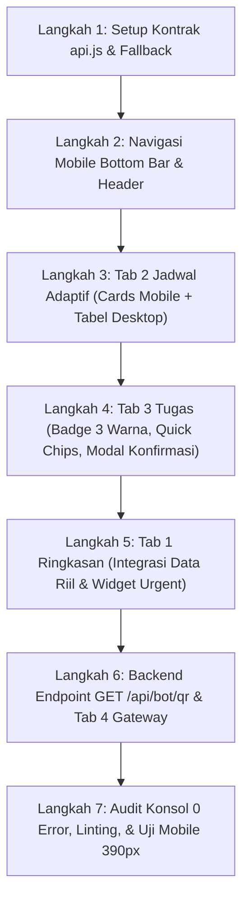

# 📱 Spesifikasi Kebutuhan Produk (PRD) — Implementasi Frontend Dashboard
# Bot Jadwal & Tugas Kuliah v2.0

> **Status:** Final & Siap Diimplementasikan  
> **Target Pengembang:** Frontend Developer (Mahasiswa), UI/UX Designer, & Backend Lead  
> **Prinsip Utama:** *Zero-Build Architecture, Thumb-Friendly Mobile-First, Anti-AI-Slop, Production-Ready.*

---

## 1. 🎯 Latar Belakang & Filosofi "Anti-AI-Slop"

### 1.1. Apa itu "AI Slop" dalam Konteks Frontend Ini?
AI Slop adalah antarmuka atau kode yang terlihat ramai di permukaan namun rapuh, tidak memikirkan ergonomi pengguna nyata, dan tidak terhubung secara presisi dengan arsitektur backend:
- Menghasilkan markup tabel kaku 5-kolom yang meluap dan hancur di layar ponsel mahasiswa (390px).
- Tidak memikirkan kondisi transisi (tidak ada *loading skeletons*, data berkedip saat ganti kelas).
- Tombol aksi tanpa proteksi *double-submit*, menyebabkan data tugas duplikat saat ditekan berulang.
- Formulir input deadline yang memaksa mahasiswa mengetik manual format tanggal panjang di keyboard ponsel.
- Menghalunisasikan WebSocket atau endpoint yang tidak ada pada backend Go.

### 1.2. Standar Solusi Kami
PRD ini mendefinisikan implementasi frontend yang **ringan, deterministik, berstandar industri, dan dirancang khusus untuk kenyamanan ketua kelas (PJ) serta mahasiswa** saat menggunakan ponsel pintar di dalam ruang kuliah maupun laptop di rumah.

---

## 2. 🛡️ Batasan Keras Arsitektur (*Hard Guardrails*)

Setiap baris kode frontend **DILARANG KERAS** melanggar aturan-aturan berikut (mengacu pada `.agent/skills/vibe-coding-guide`):

1. **Zero-Build & Single Binary (`embed.FS`):**
   - **TIDAK BOLEH** menambahkan `package.json`, `npm`, `node_modules`, Webpack, Vite, atau framework SPA berat (React/Vue/Angular).
   - Seluruh kode statis hidup di dalam direktori `web/` dan disematkan langsung ke biner Go via `web/embed.go`.
2. **Pemisahan Berkas Skrip (Separation of Concerns):**
   - `web/index.html`: Khusus struktur semantik HTML5 dan atribut direktif Alpine.js. Dilarang menulis blok `<script>` logika panjang di sini.
   - `web/js/api.js`: Lapisan komunikasi HTTP (*fetch API wrapper*), penanganan error jaringan, dan fallback lokal.
   - `web/js/app.js`: Pengelolaan state reaktif Alpine.js, formatting tanggal, dan event handling interaktif.
   - `web/css/style.css`: Kustomisasi CSS murni untuk animasi mikro dan styling scrollbar.
3. **Pustaka Pihak Ketiga (Hanya via CDN Resmi):**
   - **Tailwind CSS:** CDN `https://cdn.tailwindcss.com` dengan konfigurasi dark mode kelas.
   - **Alpine.js:** CDN `https://cdn.jsdelivr.net/npm/alpinejs@3.14.3/dist/cdn.min.js`.
   - **Google Fonts:** `Plus Jakarta Sans` (tipografi teks UI) dan `JetBrains Mono` (kode & jam).

---

## 3. 🔌 Kontrak Data Backend Riil (1:1 Go REST API)

Frontend dirancang di atas kontrak data aktual backend Go (`internal/api/`):

### 3.1. `GET /api/status` & `GET /api/health`
Mengembalikan status telemetri bot dan sistem multi-kelas:
```json
// GET /api/status (200 OK)
{
  "status": "ok",
  "timestamp": "2026-09-19T08:15:00Z",
  "bot_connection": "connected", // "connected" | "connecting" | "uninitialized" | "disconnected"
  "total_classes": 19,
  "default_class": "D4-TI-SMT3-A",
  "classes": ["D3-TI-1A", "D4-TI-3A", "..."]
}

// GET /api/health (200 OK)
{
  "status": "ok",
  "timestamp": "2026-09-19T08:15:00Z",
  "uptime": "14h25m10s"
}
```

### 3.2. `GET /api/classes`
Mengambil seluruh daftar kelas aktif yang terdaftar pada `ClassManager`:
```json
// GET /api/classes (200 OK)
{
  "status": "success",
  "data": {
    "classes": ["D3-TI-1A", "D4-TI-3A", "..."],
    "default_class": "D4-TI-SMT3-A",
    "total": 19
  }
}
```

### 3.3. `GET /api/schedule?class={class_id}&day={day}`
Mengambil jadwal kuliah mingguan berdasarkan kode kelas kanonikal:
```json
// GET /api/schedule?class=D4-TI-SMT3-A (200 OK)
{
  "status": "success",
  "data": {
    "class": "D4-TI-SMT3-A",
    "total": 8,
    "schedule": [
      {
        "hari": "Senin",
        "jam": "07:30 - 10:00",
        "kode_matkul": "TI201",
        "nama_matkul": "SISTEM BASIS DATA",
        "inisial_dosen": "SR",
        "dosen": "Siti Rahmawati, M.T",
        "ruang": "D304",
        "status": "" // "" (reguler), "ganti", atau "kosong"
      }
    ]
  }
}
```

### 3.4. `GET /api/tasks?class={class_id}`
Mengambil daftar tugas aktif (tersinkronisasi 2 arah dengan WhatsApp `!tugas`):
```json
// GET /api/tasks?class=D4-TI-SMT3-A (200 OK)
{
  "status": "success",
  "data": [
    {
      "id": 14,
      "class_id": "D4-TI-SMT3-A",
      "matkul": "SISTEM BASIS DATA",
      "deskripsi": "Kerjakan latihan normalisasi 1NF-3NF di modul hal 42.",
      "deadline": "Jumat, 25 Sep 23:59 WIB",
      "is_done": false
    }
  ]
}
```

### 3.5. `POST /api/tasks`
Menyimpan tugas baru dari Web Dashboard:
- **Request Payload:**
  ```json
  {
    "class_id": "D4-TI-SMT3-A",
    "matkul": "SISTEM BASIS DATA",
    "deskripsi": "Laporan praktikum modul 3",
    "deadline": "Besok 23:59" // Diproses oleh parser waktu alami Go
  }
  ```
- **Response:** `201 Created`
  ```json
  {
    "status": "success",
    "data": {
      "id": 15,
      "class_id": "D4-TI-SMT3-A",
      "matkul": "SISTEM BASIS DATA",
      "deskripsi": "Laporan praktikum modul 3",
      "deadline": "Besok (Minggu), 23:59 WIB",
      "is_done": false
    }
  }
  ```

### 3.6. `DELETE /api/tasks/{id}`
Menghapus atau menandai tugas selesai:
- **Response:** `200 OK`
  ```json
  {
    "status": "success",
    "message": "Tugas berhasil dihapus"
  }
  ```

---

## 4. 🔀 Bab Spesifikasi Tambahan Backend: `GET /api/bot/qr`

Untuk mendukung fitur **Live QR Code Pairing** di Tab 4 tanpa terminal SSH, backend Go perlu menambahkan satu rute baru di `internal/api/bot_handler.go`:

### Spesifikasi Endpoint:
- **Rute:** `GET /api/bot/qr`
- **Tujuan:** Menyediakan data QR Code aktif bagi klien web saat whatsmeow membutuhkan proses pemindaian (*pairing*).
- **Logika Alur:**
  1. Jika bot sudah login (`botClient.Client.IsLoggedIn() == true`):
     ```json
     {
       "status": "logged_in",
       "connected": true,
       "message": "Bot WhatsApp sudah terhubung aktif"
     }
     ```
  2. Jika bot membutuhkan scan QR:
     - Membaca event terakhir dari `qrChan` yang disediakan oleh whatsmeow.
     - Menghasilkan format QR Code SVG string atau data base64 gambar PNG (menggunakan library generator QR ringan Go seperti `github.com/skip2/go-qrcode`).
     ```json
     {
       "status": "scan_needed",
       "connected": false,
       "qr_data_uri": "data:image/svg+xml;utf8,...",
       "raw_code": "2@...wa-qr-code...",
       "timeout_seconds": 20
     }
     ```

---

## 5. 🗺️ Struktur Navigasi & Tata Letak Responsif

Aplikasi dirancang sebagai *Single Page Dashboard* dengan pemisahan tata letak yang tegas antara **Desktop** dan **Mobile**:

```text
DESKTOP (>= 768px):
┌──────────────┬────────────────────────────────────────────────────────┐
│  SIDEBAR     │ HEADER (Judul Tab, Selector Kelas, Jam WIB, Status)    │
│  (Sticky)    ├────────────────────────────────────────────────────────┤
│  - Logo      │                                                        │
│  - Ringkasan │ CONTENT AREA (Max-w-7xl, Margin Auto)                  │
│  - Jadwal    │                                                        │
│  - Tugas     │                                                        │
│  - Gateway   │                                                        │
│  - Status WA │                                                        │
└──────────────┴────────────────────────────────────────────────────────┘

MOBILE (< 768px):
┌───────────────────────────────────────────────────────────────────────┐
│ HEADER (Logo Mini, Selector Kelas Dropdown, Indikator Bot)            │
├───────────────────────────────────────────────────────────────────────┤
│                                                                       │
│ CONTENT AREA (Scrollable Vertikal, Padding 1rem)                     │
│                                                                       │
├───────────────────────────────────────────────────────────────────────┤
│ BOTTOM NAVIGATION BAR (Fixed Bottom, Thumb-Friendly, Min-H 64px)      │
│ [📊 Ringkasan]   [📅 Jadwal]   [📝 Tugas (+FAB)]   [📱 Gateway]      │
└───────────────────────────────────────────────────────────────────────┘
```

### Aturan Target Sentuh (Touch-Target Ergonomics):
- Setiap tombol navigasi di Bottom Bar memiliki tinggi minimal **56px** dan lebar area tap minimal **44 x 44px**.
- Dropdown pemilih kelas diletakkan di header atas kanan, mudah diakses tanpa menutupi konten utama.

---

## 6. 🔍 Rincian Spesifikasi & Kebutuhan Fitur per Tab

---

### Tab 1: Ringkasan Perkuliahan *(Overview)*

#### Tujuan:
Memberikan informasi instan yang dibutuhkan mahasiswa dalam **3 detik pertama** saat membuka aplikasi.

#### Komponen yang Wajib Ada:
1. **Header Sambutan & Info Waktu:**
   - Menampilkan hari ini (contoh: *Sabtu, 19 September 2026*), jam sistem WIB realtime yang berdetik setiap detik, dan nama kelas yang sedang dipilih.
2. **Kartu Metrik Cepat (4 Kartu Grid):**
   - **Mata Kuliah Aktif:** Jumlah matkul unik semester ini.
   - **Tugas Aktif:** Jumlah tugas yang belum diselesaikan (dengan warna teks amber tegas jika > 0).
   - **Grup WhatsApp:** Jumlah grup WhatsApp terhubung.
   - **Status Gateway:** Badge hijau berdenyut (*Connected*) atau kuning (*Standby*).
3. **Kartu "Kuliah Hari Ini" (Today's Schedule):**
   - Menyaring otomatis jadwal kuliah berdasarkan hari aktif saat ini (`todayName`).
   - Jika hari libur/Minggu: Menampilkan ilustrasi *Empty State* santai (*"🎉 Tidak ada perkuliahan hari ini. Waktunya istirahat atau cicil tugas!"*).
   - Jika ada kuliah: Menampilkan daftar kartu ringkas memuat jam, nama matkul, inisial dosen, dan ruangan.
4. **Widget "Tugas Mendesak" (Urgent Tasks):**
   - Menampilkan maksimal 3 tugas dengan deadline paling dekat.
   - Memiliki tombol cepat **"+ Tambah"** yang langsung memicu modal pembuatan tugas.
   - Tombol tautan teks *"Lihat Semua Tugas →"* menuju Tab 3.

---

### Tab 2: Jadwal Kuliah Mingguan *(Schedule)*

#### Tujuan:
Akses jadwal perkuliahan hari Senin hingga Jumat yang bersih, cepat, dan mudah dibaca langsung dari smartphone.

#### Komponen & Tata Letak Adaptif:
1. **Filter Hari (Day Selector Pills):**
   - Baris tombol: `[Semua] [Senin] [Selasa] [Rabu] [Kamis] [Jumat]`.
   - Menggunakan pill button rounded dengan state aktif berwarna emerald `bg-emerald-600 text-white font-bold`.
   - Di mobile: Tampilan pill dapat digeser horizontal (`overflow-x-auto whitespace-nowrap`) tanpa memotong layar.
2. **Tampilan Mobile (< 768px) — Card Timeline List:**
   - **DILARANG MENGGUNAKAN TABEL KAKU DI MOBILE**.
   - Jadwal dirender sebagai **daftar kartu vertikal**:
     - Bagian atas kartu: Jam kuliah tebal dengan badge font mono (`07:30 - 10:00 WIB`) dan badge ruangan (`D304`).
     - Bagian tengah: Nama lengkap mata kuliah dengan tipografi tebal (`SISTEM BASIS DATA`).
     - Bagian bawah: Dosen pengampu lengkap dengan inisial dosen (`SR • Siti Rahmawati, M.T`).
     - Tombol cepat: *"Salin Info Jadwal"* atau tautan kuliah daring jika tersedia.
3. **Tampilan Desktop (>= 768px) — Data Table Terstruktur:**
   - Tabel modern dengan header gelap `bg-gray-900/80` dan pembatas baris tipis `divide-gray-800/60`.
   - Kolom: **Hari**, **Jam**, **Mata Kuliah**, **Dosen Pengampu**, **Ruangan**.
   - Hover state halus `hover:bg-gray-900/40`.

---

### Tab 3: Manajemen Catatan Tugas *(Tasks)* — *Core Utility*

#### Tujuan:
Pencatatan tugas kuliah super cepat oleh Ketua Kelas/PJ (< 15 detik), pemantauan deadline akurat, dan penghapusan aman dari perangkat mobile.

#### 1. Badge Urgensi Tenggat Waktu (3 Tingkat Warna Wajib):
Perhitungan urgensi dihitung secara otomatis oleh fungsi client-side `calculateUrgency(deadlineText)`:
- 🔴 **Merah (`bg-rose-500/10 text-rose-400 border-rose-500/20`):**
  - Untuk tugas yang deadlinenya **Hari Ini**, sisa waktu < 24 jam, atau telah lewat.
  - Label teks: `🚨 MENDESAK` atau `🚨 HARI INI`.
- 🟡 **Kuning/Amber (`bg-amber-500/10 text-amber-400 border-amber-500/20`):**
  - Untuk tugas yang deadlinenya **Besok (H-1)** atau tersisa antara 1 hingga 3 hari.
  - Label teks: `⚠️ BESOK` atau `⚠️ H-2`.
- 🟢 **Hijau/Netral (`bg-emerald-500/10 text-emerald-400 border-emerald-500/20`):**
  - Untuk tugas yang deadlinenya masih **> 3 hari** ke depan.
  - Label teks: `⏳ AMAN (>3 Hari)`.

#### 2. Modal Formulir "Catat Tugas Baru" (Ergonomi Anti-Typo):
- **Pilihan Kelas Target:** Ditampilkan otomatis mengunci kelas yang sedang aktif di header (misal: *D4-TI-SMT3-A*).
- **Pilihan Mata Kuliah (Dropdown):**
  - Otomatis terisi dari kurikulum mata kuliah unik kelas terpilih (mengambil data dari `/api/schedule`).
  - Opsi tambahan: `"Umum / Tugas Non-Matkul"`.
- **Deskripsi Tugas (Textarea):**
  - Placeholder ramah: *"Contoh: Kerjakan Bab 3 di Word, kumpulkan dalam format PDF ke portal..."*.
- **Input Tenggat Waktu Cepat (Dual-Input):**
  - **Quick Shortcut Chips:** Baris tombol 1-tap di atas input:
    - `[Hari Ini 23:59]`
    - `[Besok 23:59]`
    - `[Minggu Depan (+7 Hari)]`
    Mengetuk salah satu chip akan langsung mengisi kolom teks deadline tanpa perlu mengetik manual.
  - **Custom Input:** Input teks fleksibel yang mendukung input waktu alami bahasa Indonesia yang ramah parser backend Go (`parseDeadline`).
- **Proteksi Anti-Spam (Double Submit Prevention):**
  - Tombol **"Simpan Tugas"** memiliki status loading reaktif `isSubmitting`.
  - Saat request POST berjalan, tombol otomatis `disabled`, menampilkan animasi spinner kecil, dan teks berubah menjadi *"Menyimpan..."*.

#### 3. Alur Penghapusan & Penyelesaian Tugas yang Aman:
- Menekan tombol checklist (selesai) atau tombol hapus pada kartu tugas **TIDAK BOLEH langsung menghapus tanpa konfirmasi**.
- Menampilkan dialog konfirmasi cepat (Confirmation Bottom Sheet / Modal Ringkas):
  - Pesan: *"Tandai tugas '[Nama Matkul]' sebagai selesai/hapus?"*
  - Opsi: `[Batal]` dan `[Ya, Selesaikan]`.
- Setelah disetujui, kirim `DELETE /api/tasks/{id}`.
- Munculkan Toast konfirmasi: *"✅ Tugas berhasil diselesaikan!"*.

---

### Tab 4: WhatsApp Gateway & Live Telemetry *(Bot Status)*

#### Tujuan:
Memantau kesehatan bot whatsmeow di cloud Azure dan menyediakan antarmuka scan QR code pairing tanpa perlu membuka SSH terminal.

#### Komponen yang Wajib Ada:
1. **Kartu Telemetri Koneksi Utama:**
   - **Status Koneksi:**
     - 🟢 **Online / Terhubung:** Klien whatsmeow aktif mendengarkan pesan dan siap kirim broadcast.
     - 🟡 **Standby / Perlu Login:** Sesi belum terhubung atau QR code kedaluwarsa.
     - 🔴 **Offline / Disconnected:** Server bot terhenti.
   - **Server Uptime:** Ditampilkan dari endpoint `/api/health` (contoh: *14 Jam 25 Menit*).
   - **Waktu Sinkronisasi Terakhir:** Timestamp terakhir data telemetri ditarik.
2. **Area Live QR Code Pairing (Container Adaptif):**
   - Jika `bot_connection === 'connected'`:
     - Tampilkan ilustrasi centang hijau modern: *"WhatsApp Bot Berjalan Normal. Tidak memerlukan tindakan."*
   - Jika status membutuhkan scan QR (dari `GET /api/bot/qr`):
     - Tampilkan kontainer kartu putih dengan gambar QR Code berukuran 240x240px.
     - Petunjuk langkah demi langkah:
       1. Buka aplikasi WhatsApp di HP.
       2. Pilih menu **Perangkat Tertaut** > **Tautkan Perangkat**.
       3. Arahkan kamera ponsel ke QR Code di layar ini.
     - Tombol *"Muat Ulang QR Code"* untuk memperbarui kode jika kedaluwarsa.
3. **Panel Informasi Arsitektur & Kelas:**
   - Ringkasan 19 kelas D3/D4 yang aktif dipantau.
   - Lokasi database sesi: `storage/sesi_bot.db (SQLite WAL)`.
   - Tombol manual: `[🔄 Periksa Sambungan Server]`.

---

## 7. 🎨 Desain Sistem & Aksesibilitas (Design System Tokens)

### 7.1. Palet Warna (Dedicated Dark Mode First)
- **Background Utama (Base):** `#0b0f19` (Slate sangat gelap, nyaman untuk mata).
- **Background Surface / Sidebar:** `#111827` (Gray-900).
- **Background Kartu (Card Surface):** `#161e2e` dengan border `#1f2937`.
- **Warna Aksen / Brand:**
  - Emerald 500: `#10b981` (Status aktif, tombol utama, identitas bot WhatsApp).
  - Emerald 600: `#059669` (Hover state tombol aksi).
- **Warna Status Indikator:**
  - Sukses / Aman: `#10b981` (Emerald).
  - Peringatan / H-1 s.d H-3: `#f59e0b` (Amber).
  - Bahaya / Urgent: `#f43f5e` (Rose/Red).

### 7.2. Standar Aksesibilitas (WCAG AA & Keyboard Shortcuts)
- **Kontras Teks:** Seluruh teks abu-abu sekunder minimal menggunakan `#9ca3af` (Gray-400) pada latar gelap agar lolos uji kontras rasio minimal 4.5:1.
- **Pintasan Papan Ketik (Keyboard Shortcuts):**
  - Menekan tombol `Escape`: Menutup modal yang sedang terbuka.
  - Menekan tombol `Enter` pada form modal: Memicu fungsi simpan tugas.
- **Target Sentuh Jempol:** Seluruh tombol dan kontrol form memiliki `min-height: 44px`.

---

## 8. 🔄 Penanganan 4 Status UI Wajib (*The 4 UI States*)

Sesuai aturan arsitektur `vibe-coding-guide`, setiap komponen data wajib memiliki 4 status:

| Status | Tampilan Komponen | Implementasi Teknis |
|---|---|---|
| **1. Loading State** | Kartu skeleton animasi berdenyut (`animate-pulse`) berwarna `bg-gray-800/60` | Ditampilkan saat `isLoading === true` saat inisialisasi awal atau perpindahan kelas |
| **2. Success / Default** | Data jadwal atau kartu tugas tampil rapi dengan warna badge sesuai | Ditampilkan saat data array berhasil dimuat (`tasks.length > 0`) |
| **3. Empty State** | Tampilan ramah dengan ikon emoji besar, teks ramah, dan tombol pemicu aksi (CTA) | Ditampilkan saat data kosong (`tasks.length === 0`), menyertakan tombol `+ Buat Tugas` |
| **4. Error State** | Banner peringatan merah dengan tombol *"Coba Lagi"* (`Retry`) | Ditampilkan jika HTTP request fetch mengembalikan error atau jaringan putus |

---

## 9. 🚀 Rencana Rilis & Urutan Implementasi (Step-by-Step Roadmap)



### Milestone Checklist:
- [ ] **Milestone 1:** Penyempurnaan `web/js/api.js` (koneksi penuh ke `/api/classes`, `/api/schedule`, `/api/tasks`, dan handling offline fallback).
- [ ] **Milestone 2:** Implementasi Bottom Navigation Bar pada layar mobile dan pembersihan drawer toggle lama di `web/index.html`.
- [ ] **Milestone 3:** Tampilan responsif Jadwal Kuliah (Card List di mobile, Data Table di desktop) dengan filter hari reaktif.
- [ ] **Milestone 4:** Manajemen Tugas lengkap: Pewarnaan badge 3-level otomatis, shortcut chips pada modal, proteksi double-submit, dan dialog konfirmasi hapus.
- [ ] **Milestone 5:** Tab Ringkasan (Overview) dengan metrik dinamis terhitung dan penanganan jadwal hari ini.
- [ ] **Milestone 6:** Pembuatan rute `GET /api/bot/qr` di backend Go dan integrasi kontainer Live QR Code di Tab 4.
- [ ] **Milestone 7:** Verifikasi mandiri: Pengujian pada resolusi mobile 390px, inspeksi konsol peramban bersih 100% dari error merah, dan kompilasi biner `go build ./cmd/bot`.

---

## 10. 📝 Dokumen Terkait & Referensi
- [DASHBOARD_PRD.md](DASHBOARD_PRD.md): Dokumen konsep awal desain UI/UX.
- [ARCHITECTURE.md](ARCHITECTURE.md): Arsitektur lengkap sistem Bot WhatsApp dan database SQLite WAL.
- [PANDUAN_PENGGUNAAN.md](PANDUAN_PENGGUNAAN.md): Dokumentasi seluruh perintah teks WhatsApp bot.
- [.agent/skills/vibe-coding-guide/SKILL.md](../.agent/skills/vibe-coding-guide/SKILL.md): Panduan guardrails arsitektur dan batasan teknis.
