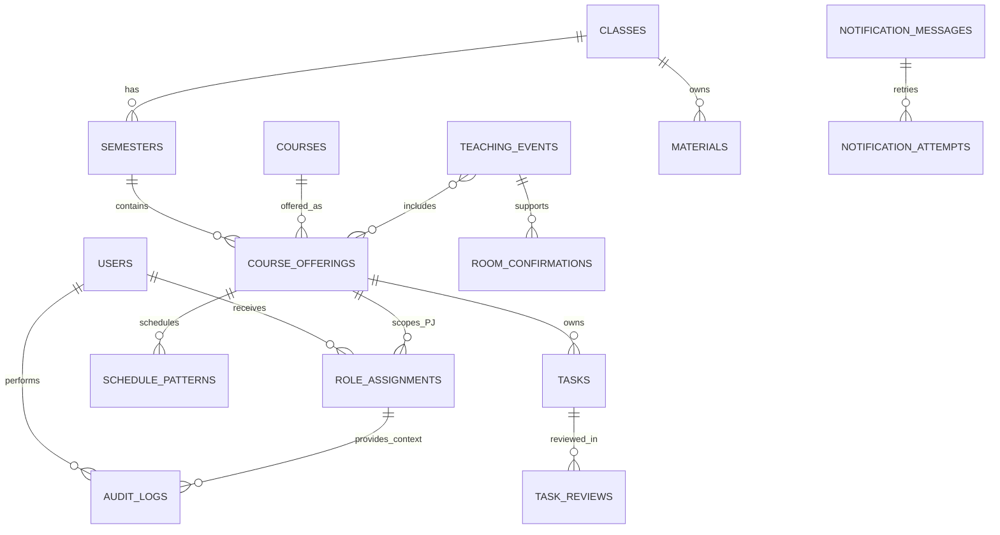

# Product Requirements Document Bot Jadwal v3.0

## Status Dokumen

| Atribut | Nilai |
|---|---|
| Versi | 3.0.0 |
| Status | Approved |
| Tanggal | 23 September 2026 |
| Pemilik | Tim Bot Jadwal |
| Target awal | Semester Ganjil 2026/2027 |
| Acuan produk | [Product Definition](product/PRODUCT_DEFINITION.md) |
| Acuan kebutuhan | [User Requirements](product/USER_REQUIREMENTS.md) |
| Kebutuhan fungsional kanonis | [Functional Requirements](product/FUNCTIONAL_REQUIREMENTS.md) |
| Ketertelusuran | [Traceability Matrix](product/TRACEABILITY.md) |
| Sumber riset | [Wawancara 11 pengguna](user-interviews/README.md) |

PRD ini menetapkan hasil produk, batas ruang lingkup, prioritas, dan kriteria keberhasilan. Product Definition menjadi sumber arah produk, User Requirements menjadi sumber kebutuhan pengguna, dan Functional Requirements menjadi satu-satunya sumber ID `FR-*`. PRD tidak mendefinisikan ulang ID kebutuhan fungsional.

## 1. Ringkasan Produk

Bot Jadwal membantu mahasiswa menerima jadwal perkuliahan, perubahan jadwal, tugas, tautan, dan pengingat melalui WhatsApp. Versi saat ini masih banyak bergantung pada command. Hasil wawancara menunjukkan bahwa keluaran bot umumnya mudah dibaca, tetapi pengurus kesulitan menghafal format input, informasi sering terlambat diperbarui, dan aktivitas bot menambah kepadatan percakapan grup.

Bot Jadwal v3.0 membagi tanggung jawab sistem sebagai berikut:

- Portal web menjadi tempat mahasiswa membaca informasi kelas.
- Dashboard pengelola menjadi tempat PJ dan KM mengelola data.
- Backend Go dan SQLite menjadi sumber data utama.
- Bot WhatsApp menjadi kanal siaran, pengingat, koreksi, dan jalur darurat.
- System Admin mengelola konfigurasi lintas kelas dan pemulihan akses.

## 2. Masalah Pengguna

1. PJ harus menghafal command panjang untuk memperbarui tugas dan jadwal.
2. Informasi akademik tersebar di WhatsApp, Teams, Classroom, email, dan slide dosen.
3. Pesan penting mudah tenggelam di grup kelas yang ramai.
4. Bot lama belum menyajikan siklus jadwal pengganti secara lengkap.
5. Mencari ruangan kosong membutuhkan pencocokan manual dan konfirmasi TU.
6. PJ harus mengingatkan mahasiswa berulang kali.
7. Kewenangan PJ, KM, dan pengelola sistem belum dibatasi dengan jelas.
8. Identitas kelas, semester, dan arsip semester lama belum dimodelkan secara konsisten.

## 3. Persona dan Peran

### 3.1 Mahasiswa

Mahasiswa membutuhkan akses cepat tanpa akun untuk melihat jadwal, tugas, perubahan, ruangan, dan materi kelas. Mahasiswa memiliki akses hanya-baca melalui tautan atau kode kelas.

### 3.2 PJ Mata Kuliah

PJ mengelola tugas, tautan, dan jadwal untuk mata kuliah yang ditugaskan. PJ dapat menyimpan draf dan langsung memublikasikan perubahan dalam cakupannya. Setiap publikasi dicatat.

### 3.3 Ketua Murid

KM mengelola semua mata kuliah pada kelas yang ditugaskan, menunjuk PJ, mengaktifkan semester, memantau perubahan, dan mencabut publikasi yang keliru. Pencabutan tidak menghapus riwayat.

### 3.4 System Admin

System Admin membuat kelas, menunjuk KM awal, mengelola master ruangan, menangani pemulihan akses, dan memantau sistem lintas kelas. Peran ini tidak digunakan untuk pekerjaan harian kelas kecuali dukungan atau pemulihan.

## 4. Tujuan Produk

1. Memindahkan aktivitas administrasi rutin dari command WhatsApp ke dashboard web.
2. Memungkinkan PJ mencatat tugas dari ponsel dalam kurang dari 30 detik.
3. Menyediakan satu sumber informasi jadwal, tugas, perubahan, ruangan, dan materi.
4. Memisahkan data berdasarkan kelas dan semester.
5. Mendukung jadwal reguler, pengganti, tambahan, libur, dan pembatalan.
6. Menerapkan hak akses berdasarkan peran, kelas, semester, dan mata kuliah.
7. Mengirimkan siaran WhatsApp yang ringkas, tepat waktu, dan tidak ganda.
8. Menjaga arsip dan audit log agar perubahan dapat ditelusuri dan dipulihkan.

## 5. Batasan Ruang Lingkup

Produk ini tidak:

- menggantikan LMS atau mengelola nilai;
- menerima unggahan berkas jawaban mahasiswa;
- mengelola kegiatan non-akademik seperti HIMA atau acara kelas;
- membuat pembagian kelompok otomatis;
- membuat polling yang sudah tersedia di WhatsApp;
- menjamin ketersediaan ruangan tanpa konfirmasi TU;
- terintegrasi dengan sistem pusat kampus tanpa akses data resmi;
- menyediakan akun individual mahasiswa pada fase awal;
- menyediakan drag and drop kalender atau auto-pin WhatsApp pada MVP.

## 6. Ruang Lingkup Fungsional

### Epic 1 Akses dan Identitas

- Mahasiswa membuka portal kelas tanpa akun melalui tautan atau kode akses.
- PJ, KM, dan System Admin memakai akun pengurus berbasis undangan.
- KM memiliki cakupan kelas yang berlanjut lintas semester sampai masa berlaku berakhir atau perannya dicabut.
- PJ memiliki cakupan course offering tertentu pada satu semester.
- Sesi portal dan sesi pengurus dapat dicabut oleh server.

### Epic 2 Kelas dan Semester

- Kelas memiliki identitas permanen dan data antarkelas terisolasi.
- Setiap kelas hanya memiliki satu semester aktif dengan tanggal mulai dan selesai.
- KM atau System Admin dapat membuat semester melalui impor JSON, salin semester, atau input manual.
- Semester lama yang pernah dipublikasikan tersedia dalam mode hanya-baca melalui kode akses kelas yang masih aktif.

### Epic 3 Jadwal Perkuliahan

- Pola jadwal reguler dipisahkan dari kejadian perkuliahan aktual seperti kelas pengganti, tambahan, libur, atau sesi yang dibatalkan.
- Satu kejadian dapat diikuti beberapa kelas tanpa menduplikasi jadwal.
- Satu kelas menjadi pemilik kejadian lintas kelas; KM kelas peserta menerima partisipasi dan dapat melepas kelasnya tanpa mengubah acara utama.
- PJ dapat membuat draf dan memublikasikan kejadian dalam cakupannya. KM dapat menerbitkan atau mencabut publikasi untuk seluruh kelas.
- Permintaan ruangan dimulai dari draf. Hasil konfirmasi manual dengan TU dicatat sebelum publikasi.

### Epic 4 Tugas dan Materi

- PJ dapat menyimpan draf atau langsung memublikasikan tugas pada mata kuliahnya.
- KM dapat menyetujui publikasi secara retrospektif, meminta koreksi sekaligus menarik publikasi, atau membatalkan tugas.
- Riwayat review tidak ditimpa. Pengarsipan disimpan terpisah dari status hasil tugas.
- Materi dapat berlaku untuk kelas secara umum atau untuk course offering tertentu.

### Epic 5 Notifikasi WhatsApp

- Sistem mengirim ringkasan jadwal, pengingat tugas, pengingat kelas pengganti sebelum pelaksanaan, serta koreksi publikasi.
- Antrean notifikasi bersifat idempoten dan tidak menentukan status data akademik.

### Epic 6 Ruangan

- System Admin mengelola master ruangan. PJ dan KM dapat mencari kandidat berdasarkan data internal.
- Sistem selalu menyatakan kandidat ruangan belum pasti sampai PJ atau KM mencatat hasil konfirmasi manual dengan TU.

### Epic 7 Audit dan Pemulihan

- Audit log mencatat pengguna, role assignment aktif, cakupan, waktu, tindakan, objek, dan perubahan data.
- Penghapusan penting dapat dipulihkan sesuai kewenangan; backup dan restore tetap terikat kelas serta semester.
- Rincian yang dapat diuji dan seluruh ID `FR-*` hanya berada pada [Functional Requirements](product/FUNCTIONAL_REQUIREMENTS.md).

## 7. Struktur Informasi

```text
Portal Kelas
├── Ringkasan
├── Jadwal
├── Tugas
├── Materi dan Tautan
└── Perubahan Terbaru

Area Pengelola
├── Kelola Jadwal
├── Kelola Tugas
├── Draf dan Persetujuan
├── Ruangan
├── Anggota dan Peran
└── Riwayat Perubahan

System Admin
├── Daftar Kelas
├── Semester
├── Pengguna
├── Master Mata Kuliah
├── Master Ruangan
└── Status Sistem
```

Detail visual, komponen, responsive behavior, dan state antarmuka mengikuti `DESIGN.md` serta spesifikasi UI yang akan diselaraskan terpisah.

## 8. Kebutuhan Pengalaman Pengguna

- Antarmuka memprioritaskan layar ponsel dengan target sentuh minimal 44 x 44 piksel.
- Form tidak memerlukan scroll horizontal pada lebar layar 390 piksel.
- Penambahan tugas normal dapat diselesaikan dalam kurang dari 30 detik.
- Setiap halaman menyediakan keadaan loading, kosong, gagal, berhasil, dan akses ditolak.
- Kegagalan penyimpanan tidak menghilangkan input tanpa peringatan.
- Status tidak disampaikan melalui warna saja.
- Fokus keyboard terlihat dan semua kontrol penting memiliki label.
- Pengurus baru mendapatkan panduan awal yang dapat dibuka kembali.
- Jadwal menggunakan nama mata kuliah dan bahasa manusiawi, bukan hanya kode internal.

## 9. Kebutuhan Non-Fungsional

### 9.1 Kinerja

- Target muat awal portal di bawah 1,5 detik pada jaringan seluler 4G dalam kondisi pengujian yang ditetapkan.
- Target respons penyimpanan operasi umum di bawah 300 milidetik, tidak termasuk waktu pengiriman WhatsApp.
- Kegagalan memenuhi target dicatat melalui telemetri agar dapat dianalisis.

### 9.2 Keamanan

- Semua mutasi data memerlukan autentikasi dan pemeriksaan izin di backend.
- Kata sandi tidak disimpan dalam bentuk asli.
- Sesi dapat dicabut ketika akun, perangkat, atau peran tidak lagi berlaku.
- Undangan dan kode pemulihan memiliki masa berlaku serta hanya dapat digunakan sesuai kebijakan.
- Data sensitif tidak dikirim ke portal mahasiswa hanya-baca.
- Endpoint mutasi dilindungi dari pemalsuan permintaan dan penyalahgunaan berulang.

### 9.3 Keandalan

- Operasi database mendukung akses web dan bot secara bersamaan tanpa kehilangan data.
- Publikasi web tidak bergantung pada koneksi aktif WhatsApp.
- Pengiriman notifikasi dapat dicoba ulang tanpa menghasilkan duplikasi.
- Aktivasi semester, impor jadwal, dan pemulihan data tidak boleh meninggalkan kondisi setengah selesai.

### 9.4 Deployability

- Aplikasi tetap menggunakan backend Go, SQLite, dan aset web tersemat dalam satu distribusi aplikasi.
- Frontend tidak memerlukan npm atau proses build terpisah.
- Data akademik, audit, dan sesi WhatsApp tetap dipisahkan agar pemulihan sesi tidak memengaruhi data kelas.

## 10. Model Domain Konseptual



Model ini bersifat konseptual. Nama tabel, atribut, indeks, dan strategi migrasi ditetapkan dalam Data Model serta ERD teknis.

## 11. Prioritas Rilis

### MVP

1. Portal kelas hanya-baca tanpa akun mahasiswa.
2. Login undangan untuk PJ, KM, dan System Admin.
3. Pemisahan kelas, semester, mata kuliah, dan hak akses.
4. Jadwal reguler serta perubahan sementara atau permanen.
5. Draf, preview, publikasi PJ, pembatalan KM, dan audit log.
6. Form tugas, publikasi langsung oleh PJ, review retrospektif KM, filter, serta arsip.
7. Siaran pagi, pengingat sore, pengingat kelas pengganti, koreksi, antrean, dan pencegahan duplikasi.
8. Perkuliahan lintas kelas dengan satu pemilik dan penerimaan KM kelas peserta.
9. Impor JSON, input manual, aktivasi, dan arsip semester.
10. Backup dan pemulihan dasar.

### Fase Lanjutan

1. Pencarian kandidat ruangan kosong.
2. Materi dan tautan terpusat.
3. Deteksi edit bersamaan yang lebih rinci.
4. Penyempurnaan onboarding dan telemetri operasional.

### Ditunda

1. Akun individual mahasiswa dan tracker penyelesaian pribadi.
2. Drag and drop kalender.
3. Auto-pin pesan WhatsApp.
4. Integrasi resmi dengan sistem ruangan TU.
5. Agenda non-akademik dan pembagian kelompok.

## 12. Ukuran Keberhasilan

- PJ dapat membuat tugas dari ponsel tanpa command dalam waktu median kurang dari 30 detik.
- Jadwal pengganti tampil di portal dan siaran bot pada hari pelaksanaan.
- Tidak ada perubahan lintas kelas atau mata kuliah tanpa izin.
- Pergantian semester tidak menghapus data semester sebelumnya.
- Publikasi dan percobaan ulang tidak menghasilkan notifikasi ganda.
- Setiap perubahan penting memiliki pelaku, waktu, data sebelum, dan data sesudah.
- Pembatalan KM mempertahankan riwayat dan menghasilkan koreksi jika diperlukan.
- Penggantian sesi WhatsApp tidak menghapus data akademik.

## 13. Template Siaran WhatsApp

### 13.1 Jadwal Pagi

```text
*JADWAL KULIAH HARI INI*
[Hari], [Tanggal] | [Nama Kelas]

1. *[Mata Kuliah]* ([Teori/Praktik])
   [Jam Mulai] - [Jam Selesai] WIB
   [Ruangan] | [Nama Dosen]

Detail jadwal dan tugas:
https://[domain]/c/[kelas]
```

### 13.2 Pengingat Tugas Sore

```text
*PENGINGAT TUGAS*
[Hari], [Tanggal]

1. *[Mata Kuliah]* | [Judul]
   Deadline: [Tanggal dan Jam]
   Tempat: [Portal atau Lokasi]

Lihat detail:
https://[domain]/c/[kelas]/tasks
```

### 13.3 Perubahan Jadwal

```text
*PERUBAHAN JADWAL*
[Mata Kuliah] ([Teori/Praktik])

Sebelum: [Hari, Jam, Ruangan]
Menjadi: [Hari, Tanggal, Jam, Ruangan]
Status: [Sementara/Permanen]
Keterangan: [Keterangan]

Detail:
https://[domain]/c/[kelas]/schedule
```

### 13.4 Koreksi atau Pembatalan

```text
*KOREKSI JADWAL*
[Mata Kuliah]

Perubahan sebelumnya dibatalkan oleh KM.
Jadwal yang berlaku: [Hari, Tanggal, Jam, Ruangan]
Alasan: [Alasan]

Detail:
https://[domain]/c/[kelas]/schedule
```

## 14. Ketertelusuran

| Kelompok User Requirement | Epic PRD |
|---|---|
| UR-ACCESS | Epic 1 Akses dan Identitas |
| UR-CLASS, UR-SEM | Epic 2 Kelas dan Semester |
| UR-SCH | Epic 3 Jadwal Perkuliahan |
| UR-TASK | Epic 4 Tugas dan Materi |
| UR-NOTIF | Epic 5 Notifikasi WhatsApp |
| UR-ROOM | Epic 6 Ruangan |
| UR-AUDIT, UR-OPS | Epic 7 Audit dan Pemulihan |
| UR-UX | Kebutuhan Pengalaman Pengguna |

Pemetaan rinci tersedia pada [Traceability Matrix](product/TRACEABILITY.md). Perubahan requirement yang telah disetujui mengikuti mekanisme perubahan dalam Product Definition.

## 15. Changelog

### 3.0.0, 23 September 2026

- Menghapus definisi ID `FR-*` dari PRD dan menetapkan Functional Requirements sebagai sumber kanonis.
- Menyelaraskan cakupan KM, model jadwal terpadu, review tugas, sesi portal, semester arsip, dan audit role context.
- Memindahkan review tugas dan dukungan perkuliahan lintas kelas ke MVP.
