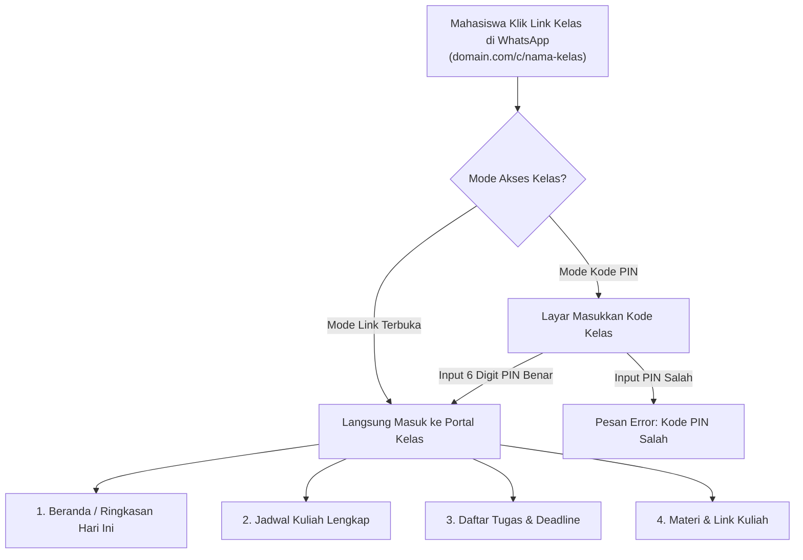

# Panduan Desain: Portal Mahasiswa (Batch 2)

Panduan ini adalah acuan kerja untuk tim UI/UX dalam merancang **Portal Mahasiswa** (halaman web untuk mahasiswa melihat jadwal, tugas, dan pengumuman kelas tanpa perlu login).

---

## 1. Konsep Utama Portal Mahasiswa

1. **Tanpa Akun & Tanpa Login:**
   - Mahasiswa tidak perlu mendaftar atau mengingat username dan password.
   - Mahasiswa cukup membuka link web kelasnya yang dibagikan KM di grup WhatsApp (contoh: `kampus.ac.id/c/d4-ti-2024-a`).
2. **Dua Mode Akses Kelas (Diatur oleh KM):**
   - **Mode Link Terbuka:** Siapa saja yang punya link bisa langsung melihat jadwal kelas.
   - **Mode Kode PIN 6-Digit:** Sebelum melihat jadwal, pengunjung diminta memasukkan 6 digit PIN kelas. Jika PIN benar, browser akan mengingatnya selama 30 hari.
3. **Fokus pada Akses Cepat di HP (Mobile-First):**
   - 90% mahasiswa akan membuka portal ini lewat ponsel pintar (smartphone) dari tautan chat grup WhatsApp.
   - Desain harus ringan, cepat, dan mudah dibaca di layar HP, namun tetap rapi saat dibuka di laptop/desktop.

---

## 2. Alur Penggunaan oleh Mahasiswa

---

## 3. Daftar Halaman & Komponen yang Perlu Dibuat

---

### Halaman 1: Layar Masukkan Kode PIN Kelas
*Halaman ini hanya muncul jika KM mengaktifkan keamanan Mode PIN pada kelas tersebut.*

* **Tujuan:** Melindungi privasi kelas dari orang luar yang tidak memiliki PIN.
* **Elemen Tampilan:**
  - Logo kampus / Bot Jadwal.
  - Judul: **"Portal Kelas D4 Teknik Informatika 2024 A"**.
  - Sub-judul ramah: *"Masukkan 6 digit kode akses kelas Anda untuk melanjutkan."*
  - **Input Kotak PIN 6-Digit:** Kotak input angka (auto-focus, otomatis pindah ke kotak berikutnya saat diketik).
  - Tombol Utama: **"Buka Portal"**.
  - Teks Bantuan di Bawah: *"Belum tahu kodenya? Tanyakan kepada Ketua Murid (KM) kelas Anda."*
* **State Error:**
  - Kode salah: Kotak bergetar halus (*shake animation*) dengan pesan teks merah: *"Kode akses tidak valid"*.
  - Salah 5 kali: Pesan peringatan: *"Terlalu banyak percobaan. Silakan coba lagi dalam beberapa saat."*

---

### Halaman 2: Beranda & Ringkasan Kelas (Tampilan Utama)
*Halaman awal saat portal terbuka. Dirancang untuk menjawab pertanyaan harian mahasiswa: **"Hari ini ada kuliah apa, di mana, dan ada tugas apa?"***

* **Elemen Tampilan:**
  - **Header Kelas:**
    - Nama Kelas: *D4 Teknik Informatika 2024 A*
    - Semester Aktif: *Semester Ganjil 2026/2027*
    - Tanggal & Hari Ini: Misal *Senin, 28 September 2026*
  - **Bagian 1: Kuliah Hari Ini (Sangat Menonjol di Atas):**
    - Jika ada kuliah: Menampilkan kartu jadwal hari ini berurutan dari jam paling awal.
      - Jam kuliah (misal: `08:00 - 10:30 WIB`).
      - Nama mata kuliah & Dosen pengampu.
      - Ruangan kuliah (misal: `Ruang Lab Komputer 2`).
      - **Badge Status Khusus (Jika Ada Perubahan):**
        - Label Hijau: *Jadwal Reguler*
        - Label Oranye: *Kelas Pengganti*
        - Label Merah: *Diliburkan / Kosong*
        - Label Biru: *Pindah Ruangan*
    - Jika tidak ada kuliah: Ilustrasi santai + teks *"Tidak ada jadwal kuliah untuk hari ini. Waktunya istirahat atau cicil tugas!"*
  - **Bagian 2: Tugas Mendesak (Deadline Terdekat):**
    - Menampilkan maksimal 2 atau 3 tugas yang tenggat waktunya paling dekat (misal: *Deadline: Besok, 23:59 WIB*).
    - Tombol cepat: *"Lihat Semua Tugas"*.
  - **Bagian 3: Pengumuman / Perubahan Terbaru:**
    - Berisi info penting terkini (misal: *"Dosen menggeser jam kuliah Basis Data ke hari Jumat"*).

---

### Halaman 3: Jadwal Kuliah Lengkap
*Menampilkan kalender perkuliahan mingguan kelas.*

* **Tujuan:** Mahasiswa bisa melihat rencana kuliah untuk hari-hari berikutnya.
* **Elemen Tampilan:**
  - **Filter Hari (Tab horizontal):** `Senin` | `Selasa` | `Rabu` | `Kamis` | `Jumat`.
  - **Daftar Kartu Kuliah per Hari:**
    - Waktu mulai & selesai.
    - Nama mata kuliah, bobot SKS, dan kelas.
    - Dosen pengampu.
    - Ruangan.
    - Link kelas daring (Zoom / GMeet) jika perkuliahan online.
  - Tanda visual yang jelas jika suatu sesi jam kuliah diganti, dipindah, atau ditiadakan.

---

### Halaman 4: Daftar Tugas & Detail Tugas
*Pusat informasi tugas perkuliahan kelas.*

* **Tujuan:** Membantu mahasiswa melacak seluruh tugas agar tidak ada yang terlewat.
* **Filter Tab:**
  - **Mendatang / Aktif:** Tugas yang deadline-nya belum lewat.
  - **Selesai:** Tugas yang sudah ditandai selesai.
  - **Semua Tugas:** Riwayat seluruh tugas.
* **Kartu Tugas pada Daftar:**
  - Nama Mata Kuliah.
  - Judul Tugas (misal: *Tugas Praktikum 3 - Pembuatan API*).
  - Waktu Deadline & Penghitung Mundur (misal: *"2 hari lagi"* atau *"Hari ini 23:59"*).
  - Label Penanggung Jawab: *"Dibuat oleh PJ Pemrograman Web"*.
* **Pop-up / Layar Detail Tugas (Saat Kartu Diklik):**
  - Judul lengkap & mata kuliah.
  - Tenggat waktu lengkap (Hari, Tanggal, Jam, Zona Waktu).
  - **Instruksi Tugas:** Penjelasan lengkap apa yang harus dikerjakan.
  - **Tempat Pengumpulan:** Link Google Classroom, Drive, Spada/LMS, atau keterangan instruksi fisik (misal: *"Kumpulkan di meja dosen gedung A"*).
  - Lampiran Materi Terkait (jika ada file panduan/slide).

---

### Halaman 5: Materi & Link Penting Kelas
*Tempat mahasiswa mencari file materi kuliah atau tautan penting kelas.*

* **Elemen Tampilan:**
  - **Kategori Materi Berdasarkan Mata Kuliah:**
    - Folder / Seksi per mata kuliah (misal: *Materi Basis Data*, *Materi Pemrograman Web*).
    - Berisi tautan slide materi, modul PDF, atau link Google Drive.
  - **Tautan Cepat Kelas (Pinned Links):**
    - Link Grup WhatsApp Kelas.
    - Link Folder Drive Bersama Kelas.
    - Link Portal Akademik Kampus (SIAKAD / LMS).

---

## 4. Navigasi Portal Mahasiswa

Karena ditujukan untuk penggunaan ponsel (mobile), navigasi terbaik adalah:
* **Pada Layar HP (Mobile):** Menggunakan **Bottom Navigation Bar** (menu di bawah layar dengan 4 ikon):
  1. `Hari Ini` (Beranda Ringkasan)
  2. `Jadwal` (Jadwal Mingguan)
  3. `Tugas` (Daftar & Detail Tugas)
  4. `Materi & Link` (Kumpulan Materi & Tautan)
* **Pada Layar Laptop/Desktop:** Menggunakan **Top Bar** bersih di bagian atas dengan logo kelas dan tab menu yang sama.

---

## 5. Ringkasan Singkat untuk Tim UI/UX

1. **Tidak ada halaman profil atau edit data:** Mahasiswa hanya sebagai pembaca (*read-only*).
2. **Prioritaskan tampilan mobile:** Pastikan tombol besar dan teks mudah dibaca di layar HP dengan satu tangan.
3. **Warna status harus intuitif:**
   - Hijau = Normal / Aman
   - Oranye = Ada Perubahan Jadwal / Tugas Segera Deadline
   - Merah = Kuliah Batal / Deadline Terlewat
