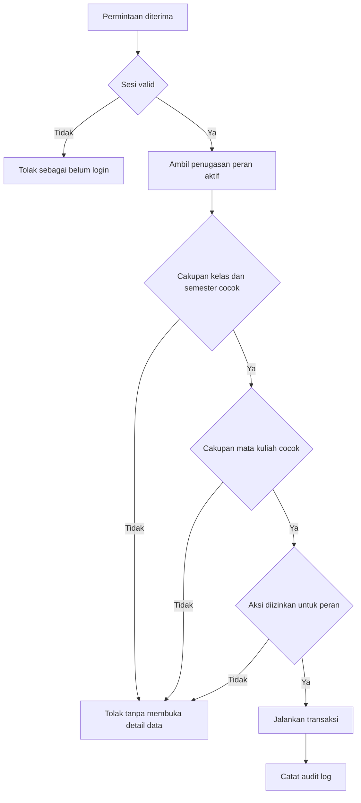
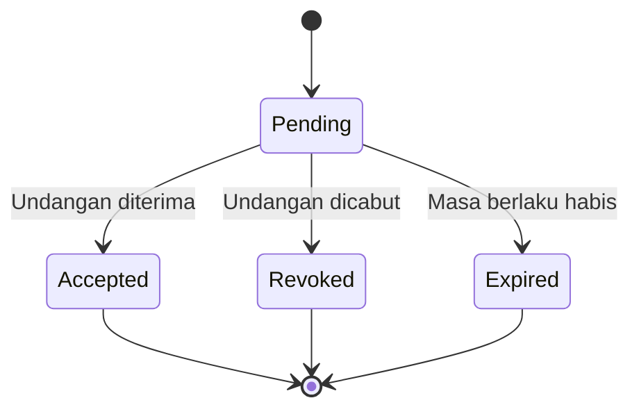

# Access Control Bot Jadwal

## Status Dokumen

| Atribut | Nilai |
|---|---|
| Versi | 2.0.0 |
| Status | Approved |
| Pemilik | Tim Bot Jadwal |
| Terakhir diperbarui | 23 September 2026 |
| Acuan produk | [Product Definition](PRODUCT_DEFINITION.md) |
| Acuan kebutuhan | [User Requirements](USER_REQUIREMENTS.md) |
| Acuan fitur | [Functional Requirements](FUNCTIONAL_REQUIREMENTS.md) |

Dokumen ini menetapkan cara pengguna memperoleh, menggunakan, dan kehilangan akses ke Bot Jadwal. Semua izin diperiksa di backend. Antarmuka boleh menyembunyikan aksi yang tidak tersedia, tetapi tampilan tersebut tidak menggantikan pemeriksaan izin pada server.

## 1. Tujuan

Access control harus memastikan:

1. Mahasiswa dapat membaca informasi kelas tanpa membuat akun.
2. Hanya pengurus terverifikasi yang dapat mengubah data.
3. PJ hanya mengelola mata kuliah yang ditugaskan.
4. KM mengelola seluruh mata kuliah pada kelasnya.
5. System Admin menangani administrasi lintas kelas tanpa menjadi operator harian.
6. Pergantian peran tidak menghapus data atau riwayat.
7. Setiap tindakan penting dapat ditelusuri.

## 2. Istilah

- **Autentikasi:** memastikan identitas pengguna.
- **Otorisasi:** menentukan tindakan yang boleh dilakukan pengguna.
- **Cakupan:** kelas, semester, dan mata kuliah tempat sebuah peran berlaku.
- **Portal kelas:** halaman hanya-baca untuk mahasiswa.
- **Undangan:** tautan sekali pakai untuk mengaktifkan akun atau penugasan peran.
- **Sesi:** akses pengguna setelah login berhasil.
- **Break-glass access:** akses dukungan sementara oleh System Admin untuk menangani insiden.

## 3. Prinsip Akses

- Tidak ada pendaftaran akun pengurus secara publik.
- Pengguna tidak dapat memberikan peran kepada dirinya sendiri.
- Izin diberikan berdasarkan cakupan, bukan hanya nama peran.
- Akses minimum diberikan sesuai tugas pengguna.
- Penolakan akses menjadi perilaku default jika cakupan tidak dapat dibuktikan.
- Pencabutan peran berlaku segera untuk tindakan baru.
- Perubahan peran, pemulihan akun, dan akses dukungan dicatat.
- System Admin tidak mengubah data akademik tanpa alasan dukungan yang tercatat.

## 4. Model Identitas dan Cakupan

Satu akun dapat memiliki beberapa penugasan peran.

```text
User
└── Role Assignment
    ├── Role
    ├── Class
    ├── Course Offering (wajib untuk PJ)
    ├── Status
    ├── Valid From
    └── Valid Until
```

### 4.1 Cakupan Peran

| Peran | Cakupan |
|---|---|
| Mahasiswa | Portal kelas melalui tautan atau kode, tanpa akun |
| PJ | Mata kuliah tertentu pada kelas dan semester tertentu |
| KM | Semua mata kuliah pada kelas selama penugasan masih aktif |
| System Admin | Global untuk administrasi sistem dan dukungan |

Penugasan KM berlanjut saat semester berganti dan hanya berhenti ketika `valid_until` terlewati atau perannya dicabut. Penugasan PJ tidak berlaku otomatis pada semester berikutnya karena selalu menunjuk course offering tertentu. KM atau System Admin harus membuat penugasan PJ baru untuk offering semester berikutnya.

## 5. Portal Mahasiswa Tanpa Akun

Setiap kelas memiliki slug tetap, misalnya `/c/d4-ti-2024-a`. KM dapat memilih salah satu mode akses:

1. **Tautan kelas:** informasi umum dapat dibuka oleh siapa pun yang memiliki tautan.
2. **Kode kelas:** pengunjung memasukkan kode akses dan browser menyimpan sesi portal terbatas.

Kedua mode hanya memberikan akses baca. Kode kelas:

- dapat dirotasi oleh KM;
- tidak memberikan akses ke area pengelola;
- tidak dapat digunakan sebagai kredensial API administrasi;
- tidak membuka audit log, data akun, nomor telepon, atau konfigurasi bot.

Sesi portal disimpan pada database dengan token hash, `class_id`, `access_code_version`, waktu kedaluwarsa, dan waktu pencabutan. Rotasi kode menaikkan `access_code_version` dan langsung membatalkan seluruh sesi portal versi lama. Kode kelas aktif juga membuka semester lama yang pernah dipublikasikan dalam mode hanya-baca.

Tautan rapat daring hanya ditampilkan setelah akses kelas valid. Jika kelas memakai mode tautan tanpa kode, KM dapat memilih untuk menyembunyikan tautan rapat dan menampilkannya hanya melalui pesan WhatsApp.

## 6. Pembuatan Akun dan Undangan

### 6.1 System Admin Pertama

System Admin pertama dibuat melalui proses provisioning saat instalasi. Tidak tersedia endpoint publik untuk membuat System Admin pertama. System Admin yang aktif dapat mengundang System Admin tambahan jika kebijakan tim mengizinkannya.

### 6.2 Undangan KM

1. System Admin membuat atau memilih kelas.
2. System Admin memasukkan identitas calon KM.
3. Sistem membuat undangan sekali pakai dengan masa berlaku.
4. Calon KM membuka undangan, memverifikasi identitas, dan membuat kata sandi.
5. Setelah aktivasi, KM memperoleh cakupan kelas yang ditentukan.

### 6.3 Undangan PJ

1. KM memilih semester dan mata kuliah.
2. KM memasukkan identitas calon PJ.
3. Sistem membuat undangan sekali pakai.
4. Calon PJ mengaktifkan akun atau menambahkan penugasan ke akun yang sudah ada.
5. PJ memperoleh cakupan hanya pada mata kuliah yang dipilih.

Undangan kedaluwarsa setelah waktu yang dikonfigurasi, hanya dapat digunakan sekali, dan dapat dicabut sebelum digunakan. Pengiriman ulang membuat token baru dan membatalkan token sebelumnya.

## 7. Login, Sesi, dan Pemulihan

### 7.1 Login

PJ, KM, dan System Admin masuk menggunakan identitas akun dan kata sandi. Sistem tidak bergantung pada koneksi WhatsApp untuk login normal.

- Kata sandi minimal 12 karakter dan tidak boleh sama dengan identitas login.
- Lima kegagalan dalam 15 menit mengunci login selama 15 menit untuk identitas dan sumber permintaan terkait.
- Login berhasil mereset penghitung kegagalan tanpa menghapus catatan audit.
- MFA tidak termasuk MVP.

### 7.2 Sesi

Sesi harus:

- dapat dicabut dari server;
- berakhir setelah masa tidak aktif dan batas maksimum sesi;
- menggunakan cookie yang tidak dapat dibaca JavaScript;
- hanya dikirim melalui koneksi aman pada produksi;
- diganti setelah login atau perubahan tingkat akses;
- tidak menyimpan token administrasi di local storage.

Sesi PJ dan KM berakhir setelah 2 jam tidak aktif atau 24 jam sejak dibuat. Sesi System Admin berakhir setelah 30 menit tidak aktif atau 8 jam sejak dibuat. Perubahan kata sandi, pencabutan role assignment, dan rotasi kredensial mencabut sesi yang terdampak.

Perubahan kata sandi, pencabutan akun, atau insiden keamanan dapat mencabut seluruh sesi aktif pengguna.

### 7.3 Pemulihan Akun

Pemulihan dapat menggunakan verifikasi WhatsApp atau kode pemulihan. Jika bot offline, System Admin dapat memulai pemulihan manual setelah verifikasi identitas di luar sistem. Setiap pemulihan mencabut token pemulihan lama dan masuk audit log.

## 8. Matriks Izin

### 8.1 Informasi Akademik

| Aksi | Mahasiswa | PJ | KM | System Admin |
|---|:---:|:---:|:---:|:---:|
| Melihat jadwal kelas | Ya | Ya | Ya | Dukungan |
| Melihat tugas kelas | Ya | Ya | Ya | Dukungan |
| Melihat materi dan tautan yang diizinkan | Ya | Ya | Ya | Dukungan |
| Melihat semester lama | Jika dipublikasikan | Ya | Ya | Ya |

### 8.2 Tugas

| Aksi | Mahasiswa | PJ | KM | System Admin |
|---|:---:|:---:|:---:|:---:|
| Membuat tugas | Tidak | Mata kuliah sendiri | Semua matkul di kelasnya | Dukungan |
| Mengubah draf tugas | Tidak | Mata kuliah sendiri | Semua matkul di kelasnya | Dukungan |
| Memublikasikan tugas | Tidak | Mata kuliah sendiri | Semua matkul di kelasnya | Dukungan |
| Mereview tugas setelah publikasi | Tidak | Tidak | Ya | Dukungan |
| Menarik tugas untuk koreksi | Tidak | Tidak | Ya | Dukungan |
| Mengarsipkan tugas | Tidak | Mata kuliah sendiri | Semua matkul di kelasnya | Dukungan |
| Memulihkan tugas terhapus | Tidak | Lingkup sendiri | Kelasnya | Ya |

### 8.3 Jadwal

| Aksi | Mahasiswa | PJ | KM | System Admin |
|---|:---:|:---:|:---:|:---:|
| Membuat perubahan atau draf | Tidak | Mata kuliah sendiri | Semua matkul di kelasnya | Dukungan |
| Mengubah draf | Tidak | Mata kuliah sendiri | Semua matkul di kelasnya | Dukungan |
| Memublikasikan perubahan | Tidak | Mata kuliah sendiri | Semua matkul di kelasnya | Dukungan |
| Membatalkan perubahan terbit | Tidak | Tidak | Ya | Dukungan |
| Mengubah jadwal reguler permanen | Tidak | Mata kuliah sendiri | Semua matkul di kelasnya | Dukungan |
| Mengaktifkan semester | Tidak | Tidak | Ya | Ya |

PJ yang menemukan kesalahan setelah publikasi dapat membuat koreksi baru atau meminta KM mencabut publikasi. Hanya KM yang mencabut teaching event terbit agar koreksi kelas memiliki satu penanggung jawab yang jelas.

### 8.4 Pengguna dan Peran

| Aksi | Mahasiswa | PJ | KM | System Admin |
|---|:---:|:---:|:---:|:---:|
| Mengundang PJ | Tidak | Tidak | Kelasnya | Ya |
| Mencabut atau mengganti PJ | Tidak | Tidak | Kelasnya | Ya |
| Mengundang KM | Tidak | Tidak | Tidak | Ya |
| Mencabut atau mengganti KM | Tidak | Tidak | Tidak | Ya |
| Membuat kelas | Tidak | Tidak | Tidak | Ya |
| Menambah System Admin | Tidak | Tidak | Tidak | Ya |

### 8.5 Ruangan, Audit, dan Operasional

| Aksi | Mahasiswa | PJ | KM | System Admin |
|---|:---:|:---:|:---:|:---:|
| Mencari kandidat ruangan | Baca hasil jika ditampilkan | Ya | Ya | Ya |
| Mengusulkan koreksi data ruangan | Tidak | Tidak | Ya | Ya |
| Mengubah master ruangan | Tidak | Tidak | Tidak | Ya |
| Melihat audit log | Tidak | Lingkup sendiri | Kelasnya | Semua kelas |
| Backup dan pemulihan | Tidak | Tidak | Permintaan kelas | Ya |
| Melihat status sistem global | Tidak | Tidak | Tidak | Ya |

`Dukungan` berarti System Admin hanya melakukan aksi tersebut untuk pemulihan atau insiden. Sistem meminta alasan sebelum aksi dan mencatatnya sebagai akses dukungan.

## 9. Evaluasi Izin pada Backend

Setiap permintaan perubahan harus melewati pemeriksaan berikut:



System Admin melewati cakupan akademik hanya saat menjalankan fungsi global atau dukungan. Aksi dukungan tetap memerlukan alasan dan audit log.

## 10. Siklus Peran



- Status undangan adalah `PENDING`, `ACCEPTED`, `EXPIRED`, atau `REVOKED`.
- Undangan `ACCEPTED` membuat role assignment terpisah; undangan tidak menjadi role assignment.
- Status role assignment adalah `ACTIVE`, `SUSPENDED`, atau `REVOKED`.
- Role assignment hanya efektif ketika berstatus `ACTIVE`, waktu sekarang tidak lebih awal dari `valid_from`, dan belum melewati `valid_until` jika batas akhir diisi.

Berakhirnya semester tidak menonaktifkan KM. Role assignment PJ tetap tersimpan untuk audit, tetapi course offering pada semester arsip hanya dapat dibaca.

## 11. Pergantian Pengurus

### 11.1 Pergantian PJ

KM mencabut penugasan PJ lama dan mengundang PJ baru untuk mata kuliah yang sama. Data, publikasi, dan audit milik PJ lama tetap tersimpan. PJ lama kehilangan akses perubahan segera setelah pencabutan.

### 11.2 Pergantian KM

System Admin menunjuk KM baru dan mencabut atau menangguhkan KM lama. Sistem meminta konfirmasi bahwa kelas tidak akan kehilangan seluruh KM aktif. Jika hanya ada satu KM, penunjukan pengganti dilakukan sebelum pencabutan kecuali pada insiden keamanan.

### 11.3 Lebih dari Satu Pengurus

Satu mata kuliah dapat memiliki beberapa PJ. Satu kelas dapat memiliki lebih dari satu KM jika kebijakan operasional memerlukannya. Setiap tindakan tetap mencatat akun pelaku, bukan hanya perannya.

## 12. Konflik Peran

Jika satu pengguna memiliki beberapa peran, izin dihitung berdasarkan konteks yang sedang diakses:

- KM kelas A tidak memperoleh akses ke kelas B hanya karena menjadi PJ di kelas B.
- PJ untuk dua mata kuliah memperoleh izin edit pada kedua mata kuliah tersebut.
- System Admin yang juga menjadi KM menggunakan konteks KM untuk pekerjaan kelas biasa.
- Peran dengan cakupan lebih luas tidak boleh mengubah pemilik data atau riwayat tindakan sebelumnya.

Antarmuka menampilkan konteks kelas, semester, dan peran aktif agar pengguna memahami cakupan tindakannya.

## 13. Audit Keamanan

Sistem mencatat:

- login berhasil dan gagal;
- pembuatan, penggunaan, kedaluwarsa, dan pencabutan undangan;
- perubahan kata sandi dan pemulihan akun;
- pembuatan, perubahan, penangguhan, dan pencabutan peran;
- rotasi kode kelas;
- publikasi dan pembatalan data akademik;
- aksi dukungan System Admin;
- pencabutan sesi dan kejadian akses ditolak yang relevan.

Audit log mengikuti cakupan tampilan pada matriks izin dan disimpan selama kelas aktif ditambah sekurangnya satu tahun akademik.

## 14. Penanganan Kesalahan

- Pengguna yang belum login menerima permintaan login tanpa detail data internal.
- Pengguna terautentikasi tanpa izin menerima pesan bahwa tindakan tidak tersedia pada cakupannya.
- Respons tidak mengungkap apakah data kelas atau akun di luar cakupan benar-benar ada.
- Form mempertahankan input ketika sesi berakhir dan meminta pengguna login kembali sebelum mencoba menyimpan.
- Undangan kedaluwarsa menyediakan cara meminta undangan baru kepada pemberi akses.
- Kode kelas salah dibatasi percobaannya untuk mencegah penebakan berulang.

## 15. Kriteria Penerimaan

Access control dianggap siap ketika:

1. Mahasiswa tidak dapat menjalankan operasi perubahan melalui portal maupun API.
2. PJ tidak dapat mengubah mata kuliah di luar penugasannya.
3. KM tidak dapat mengubah kelas di luar penugasannya.
4. PJ dapat memublikasikan perubahan pada mata kuliahnya dan tindakan tercatat.
5. Hanya KM yang dapat mencabut teaching event yang telah terbit.
6. Pencabutan peran mencegah permintaan perubahan berikutnya.
7. Pergantian KM atau PJ tidak menghapus data lama.
8. System Admin dapat memulihkan akses dengan alasan dan audit log.
9. Bot offline tidak mencegah login normal pengurus.
10. Setiap pengujian izin mencakup skenario diizinkan dan ditolak.

## 16. Ketertelusuran

| User Requirement | Cakupan Access Control |
|---|---|
| UR-ACCESS-001 | Portal mahasiswa tanpa akun |
| UR-ACCESS-002 | Undangan, login, sesi, dan pemulihan |
| UR-ACCESS-003 | Cakupan PJ |
| UR-ACCESS-004 | Cakupan KM |
| UR-ACCESS-005 | Multi-peran dan konflik peran |
| UR-ACCESS-006 | Pemulihan oleh System Admin |
| UR-CLASS-001 | Isolasi kelas |
| UR-SEM-001 | Aktivasi dan arsip semester |
| UR-SCH-006 | Publikasi PJ |
| UR-SCH-007 | Pembatalan KM |
| UR-AUDIT-001 | Pencatatan tindakan |
| UR-OPS-003 | Pemulihan data dan akses |

Perubahan izin harus memperbarui Product Definition, User Requirements, Functional Requirements, data model, dan test case yang terdampak.

## 17. Changelog

### 2.0.0, 23 September 2026

- Memisahkan lifecycle undangan dari role assignment.
- Menetapkan KM sebagai peran kelas lintas semester dan PJ sebagai peran course offering.
- Menetapkan sesi portal berbasis database, rotasi versi kode, password tanpa MFA, rate limiting, dan masa sesi per peran.
