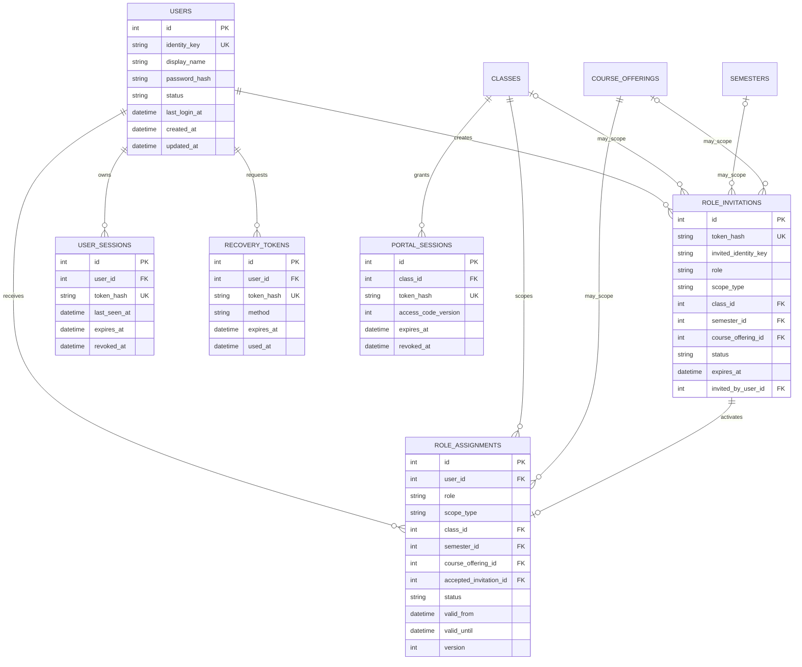
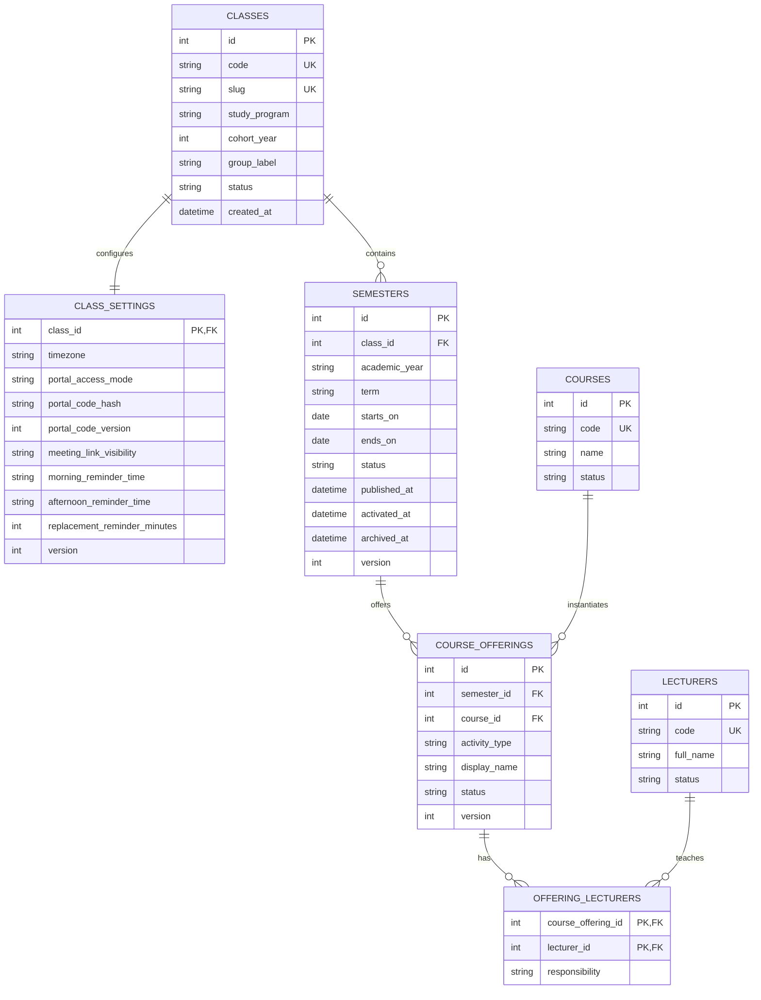
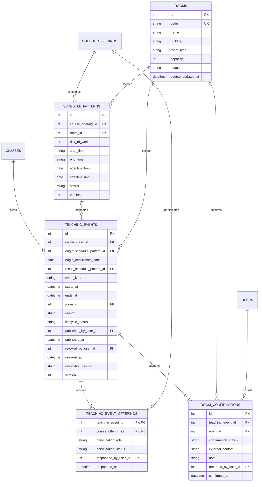
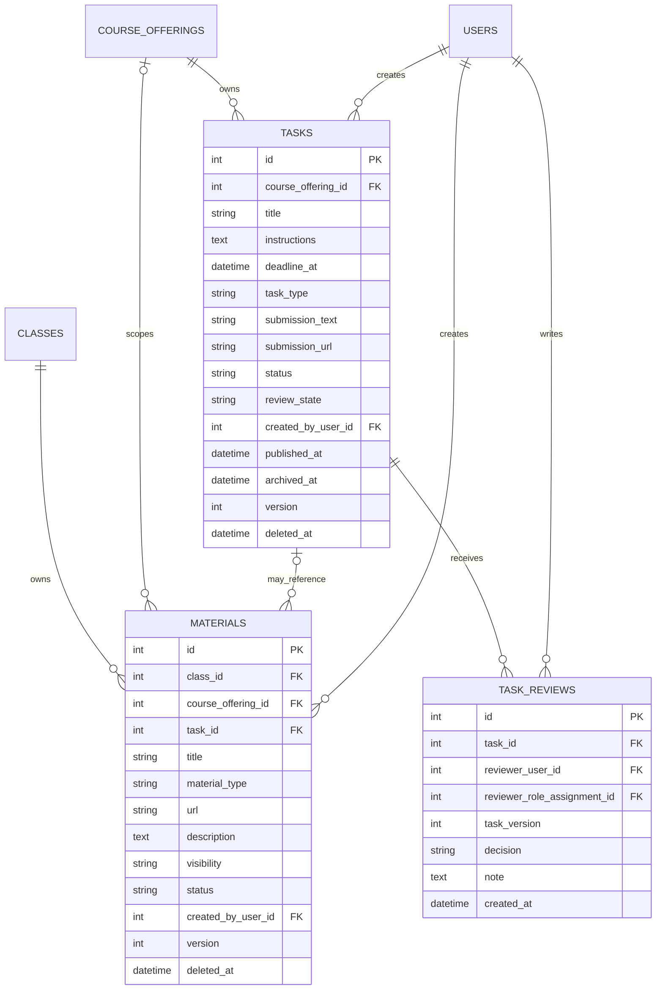
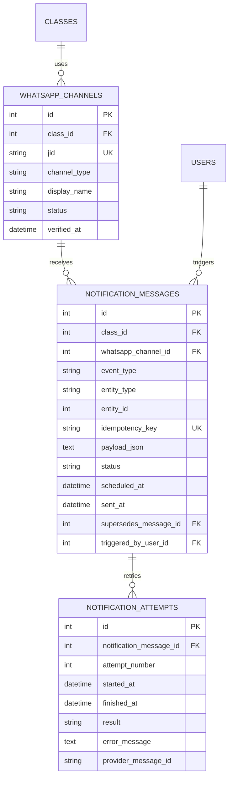

# Data Model Bot Jadwal

## Status Dokumen

| Atribut | Nilai |
|---|---|
| Versi | 2.0.0 |
| Status | Approved |
| Pemilik | Tim Bot Jadwal |
| Terakhir diperbarui | 23 September 2026 |
| Model | Target logical data model untuk SQLite |
| Acuan | [Product Definition](PRODUCT_DEFINITION.md), [Access Control](ACCESS_CONTROL.md), [Business Rules](BUSINESS_RULES.md), [Functional Requirements](FUNCTIONAL_REQUIREMENTS.md), dan [Information Architecture](INFORMATION_ARCHITECTURE.md) |
| Visualisasi | [Entity Relationship Diagram](ERD.md) |

Dokumen ini mendefinisikan entitas, relasi, constraint, status, kepemilikan data, dan arah migrasi menuju aplikasi berbasis kelas serta semester. Model ini belum merupakan migration SQL. Nama kolom dapat disesuaikan saat implementasi selama relasi dan aturan yang dijelaskan tetap dipenuhi.

## 1. Tujuan dan Prinsip

Model data harus:

1. Memisahkan data setiap kelas dan semester.
2. Menyimpan cakupan akses pada data, bukan hanya pada antarmuka.
3. Mempertahankan riwayat jadwal, tugas, publikasi, pembatalan, dan perubahan peran.
4. Memisahkan status data akademik dari status pengiriman WhatsApp.
5. Mendukung impor JSON, input manual, soft delete, optimistic locking, backup, dan restore.
6. Menjadikan SQLite sebagai sumber data utama setelah migrasi. Berkas JSON tetap menjadi format impor, bukan database operasional.

## 2. Konvensi Penyimpanan

- Nama tabel dan kolom menggunakan `snake_case` berbahasa Inggris agar konsisten dengan kode Go.
- Setiap primary key menggunakan nama `id`. Implementasi awal boleh memakai `INTEGER PRIMARY KEY`; URL publik menggunakan `slug` atau token acak, bukan ID internal.
- Foreign key menggunakan pola `<entity>_id` dan wajib memakai constraint referensial.
- Waktu kejadian disimpan sebagai UTC dalam format yang dapat dibandingkan. Zona waktu kelas disimpan pada `class_settings.timezone` dan digunakan saat menampilkan atau menghitung deadline.
- Entitas yang dapat diubah bersama memiliki `version` yang bertambah setiap penyimpanan.
- Entitas yang dapat dipulihkan memiliki `deleted_at` dan `deleted_by_user_id`. Nilai `NULL` berarti data aktif.
- `created_at` dan `updated_at` wajib tersedia pada data operasional. Kolom pelaku ditambahkan jika tindakan manusia relevan.
- Nilai status dibatasi melalui `CHECK` constraint atau tabel referensi. Aplikasi tidak boleh menyimpan status bebas.
- Snapshot audit dan payload notifikasi boleh memakai JSON, tetapi hubungan bisnis utama tetap menggunakan foreign key.

## 3. Pembagian Domain

| Domain | Entitas Utama | Fungsi |
|---|---|---|
| Identitas dan akses | `users`, `role_assignments`, `role_invitations`, `user_sessions`, `portal_sessions`, `recovery_tokens` | Login, undangan, sesi pengurus, sesi portal, serta cakupan peran |
| Akademik | `classes`, `class_settings`, `semesters`, `courses`, `course_offerings`, `lecturers`, `offering_lecturers` | Identitas kelas, semester, mata kuliah, dan dosen |
| Jadwal | `rooms`, `schedule_patterns`, `teaching_events`, `teaching_event_offerings`, `room_confirmations` | Pola reguler, kejadian aktual, partisipasi lintas kelas, konflik, dan ruangan |
| Tugas dan materi | `tasks`, `task_reviews`, `materials` | Tugas, review KM, deadline, tautan pengumpulan, dan materi |
| WhatsApp | `whatsapp_channels`, `notification_messages`, `notification_attempts` | Tujuan siaran, antrean, idempotensi, dan hasil kirim |
| Operasional | `audit_logs`, `import_batches`, `import_errors`, `backup_records` | Audit, impor, backup, dan pemulihan |

## 4. ERD Identitas dan Akses

### 4.1 `users`

`users` menyimpan identitas pengurus, bukan mahasiswa. `identity_key` adalah identitas login yang telah dinormalisasi, misalnya nomor WhatsApp atau email sesuai kebijakan implementasi. Nilai aslinya tidak boleh dipakai sebagai password atau token.

Status yang diizinkan: `ACTIVE`, `SUSPENDED`, `REVOKED`. Kata sandi hanya disimpan sebagai `password_hash`. System Admin juga memakai tabel ini dan dibedakan melalui role assignment global.

### 4.2 `role_assignments`

`scope_type` menentukan kombinasi foreign key yang valid:

| Role | Scope | Kolom Wajib | Kolom Kosong |
|---|---|---|---|
| `SYSTEM_ADMIN` | `GLOBAL` | `user_id` | `class_id`, `semester_id`, `course_offering_id` |
| `KM` | `CLASS` | `user_id`, `class_id` | `semester_id`, `course_offering_id` |
| `PJ` | `COURSE_OFFERING` | `user_id`, `class_id`, `semester_id`, `course_offering_id` | Tidak ada kolom scope yang kosong |

Status yang diizinkan: `ACTIVE`, `SUSPENDED`, atau `REVOKED`. Penugasan hanya efektif jika waktu sekarang berada dalam rentang `valid_from` dan `valid_until` bila diisi. Kombinasi pengguna, role, scope, dan status aktif harus unik. `class_id` serta `semester_id` pada PJ harus sama dengan kelas dan semester milik `course_offering_id`.

KM memakai scope kelas agar dapat membuat semester pengganti dan mengelola pengaturan permanen kelas. Pergantian semester tidak membuat role assignment KM baru; masa jabatan dibatasi dengan `valid_until` atau pencabutan.

### 4.3 `role_invitations`, `user_sessions`, `portal_sessions`, dan `recovery_tokens`

- Token disimpan sebagai hash, hanya dapat digunakan sekali, dan memiliki waktu kedaluwarsa.
- Satu undangan memuat salinan scope yang akan dibuat. Penerima tidak dapat mengubah scope tersebut. Status undangan: `PENDING`, `ACCEPTED`, `EXPIRED`, atau `REVOKED`.
- Undangan `ACCEPTED` membuat role assignment baru yang menunjuk `accepted_invitation_id`; status undangan tidak dipakai sebagai status role assignment.
- Pengiriman ulang membuat undangan baru dan mengubah undangan sebelumnya menjadi `REVOKED`.
- Sesi menyimpan token hash, waktu terakhir aktif, waktu kedaluwarsa, dan waktu pencabutan.
- `portal_sessions` menyimpan token hash, kelas, dan versi kode. Rotasi kode menaikkan `class_settings.portal_code_version` sehingga seluruh sesi versi lama ditolak.
- Pemulihan yang berhasil menandai token `used_at` dan dapat mencabut sesi aktif sesuai kebijakan keamanan.

## 5. ERD Akademik

### 5.1 `classes` dan `class_settings`

`classes.code` adalah identitas permanen seperti `D4-TI-2024-A`. Semester tidak menjadi bagian identitas ini. `slug` digunakan pada portal `/c/{slug}`. Status kelas: `ACTIVE`, `INACTIVE`, atau `ARCHIVED`.

`class_settings` menyimpan konfigurasi satu-ke-satu yang dapat berubah tanpa mengubah identitas kelas:

- `portal_access_mode`: `LINK` atau `CODE`.
- `portal_code_hash`: wajib jika mode `CODE`, tidak menyimpan kode asli.
- `portal_code_version`: bertambah setiap kode dirotasi dan digunakan untuk memvalidasi sesi portal.
- `meeting_link_visibility`: `VALID_CLASS_ACCESS` atau `WHATSAPP_ONLY`.
- Waktu pengingat memakai jam lokal dan divalidasi terhadap `timezone`; `replacement_reminder_minutes` mengatur jeda pengingat kelas pengganti.

Sesi portal wajib disimpan pada `portal_sessions`. Sesi tersebut tidak memberikan hak perubahan data.

### 5.2 `semesters`

Status semester: `DRAFT`, `ACTIVE`, `ARCHIVED`. `starts_on` wajib lebih awal daripada `ends_on`. Constraint atau transaksi aplikasi memastikan hanya satu baris `ACTIVE` per kelas. Kombinasi `class_id`, `academic_year`, dan `term` harus unik.

Aktivasi semester baru mengisi `published_at` dan mengarsipkan semester lama dalam satu transaksi. `published_at` menandai bahwa semester pernah tersedia di portal. Semester arsip tidak menerima perubahan biasa dan hanya terlihat oleh mahasiswa jika `published_at` terisi.

### 5.3 `courses`, `course_offerings`, dan dosen

`courses` adalah master mata kuliah lintas kelas. `course_offerings` adalah pelaksanaan mata kuliah pada satu semester kelas. Teori dan praktikum dapat menjadi offering terpisah melalui `activity_type` agar memiliki jadwal, dosen, dan PJ berbeda.

`offering_lecturers` mendukung lebih dari satu dosen untuk satu offering. `responsibility` dapat berisi `PRIMARY`, `ASSISTANT`, atau `OTHER`. Menonaktifkan master mata kuliah atau dosen tidak menghapus offering lama.

## 6. ERD Jadwal dan Ruangan

### 6.1 `rooms`

Status ruangan: `ACTIVE` atau `INACTIVE`. `source_updated_at` memberi konteks umur data pada hasil pencarian. `capacity` boleh kosong jika belum tersedia. Ruangan nonaktif tidak dapat dipilih untuk jadwal baru, tetapi referensi lama tetap valid.

### 6.2 `schedule_patterns`

Satu baris mewakili jadwal reguler pada rentang tanggal efektif. `day_of_week` memakai nilai 1 sampai 7, bukan nama hari, agar pencarian konsisten. `start_time` harus lebih awal daripada `end_time`. `effective_until` boleh kosong untuk versi yang masih berlaku.

Perubahan permanen menutup `effective_until` versi lama dan membuat `schedule_patterns` baru. Riwayat tidak ditimpa. Status yang diizinkan: `ACTIVE`, `SUPERSEDED`, `ARCHIVED`, `DELETED`.

### 6.3 `teaching_events`

- `event_kind`: `REPLACEMENT`, `EXTRA`, `HOLIDAY`, atau `SESSION_CANCELLED`.
- `lifecycle_status`: `DRAFT`, `PUBLISHED`, atau `REVOKED`. Status akademik tidak dicampur dengan lifecycle publikasi.
- Event tambahan boleh tidak memiliki `origin_schedule_pattern_id`. Event pengganti dan pembatalan sesi wajib menunjuk pola serta `origin_occurrence_date`.
- Perubahan permanen membuat pola baru dan menyimpannya pada `result_schedule_pattern_id`; pola lama tetap tersedia sebagai riwayat.
- Pencabutan publikasi mengisi pelaku, waktu, serta alasan tanpa menghapus data publikasi.

Konflik dihitung dari pola dan event terbit. Jika pengguna melanjutkan konflik nonpemblokir, alasan disimpan pada `teaching_events.conflict_override_reason`.

### 6.4 `teaching_event_offerings`

Setiap event memiliki tepat satu baris `OWNER` yang course offering-nya berasal dari `owner_class_id`. Offering kelas lain memakai `PARTICIPANT` dengan status `PENDING`, `ACCEPTED`, `DECLINED`, atau `REMOVED`. Event hanya tampil pada kelas peserta dengan status `ACCEPTED`. KM peserta dapat mengubah status partisipasinya, tetapi tidak dapat mengubah event utama.

### 6.5 `room_confirmations`

Status konfirmasi: `PENDING`, `CONFIRMED`, atau `REJECTED`. Teaching event draf wajib sudah ada sebelum konfirmasi dicatat. `external_contact` menyimpan nama petugas atau keterangan sumber konfirmasi manual, bukan akun TU. Catatan tidak mengubah `rooms`; sistem tetap menyebut ruangan sebagai kandidat sampai status `CONFIRMED`.

## 7. ERD Tugas dan Materi

### 7.1 `tasks`

Status hasil tersimpan: `DRAFT`, `PUBLISHED`, `COMPLETED`, `OVERDUE`, atau `REVOKED`. `archived_at` dan `deleted_at` adalah dimensi terpisah dan tidak mengganti status hasil. Kelompok Hari Ini, Minggu Ini, dan Mendatang dihitung dari `deadline_at` serta zona waktu kelas.

Aturan utama:

- `title`, `instructions`, `deadline_at`, dan salah satu dari `submission_text` atau `submission_url` wajib sebelum publikasi.
- Publikasi PJ langsung menghasilkan `review_state = NOT_REVIEWED`.
- Lewatnya deadline mengubah tugas aktif menjadi `OVERDUE`, bukan menghapusnya.
- `version` mendukung deteksi konflik. Riwayat nilai sebelum dan sesudah disimpan pada audit log.

### 7.2 `task_reviews`

`task_reviews` bersifat append-only. `decision` bernilai `APPROVED`, `CHANGES_REQUESTED`, atau `REVOKED`; dua nilai terakhir wajib memiliki `note` dan menarik tugas dari portal. `CHANGES_REQUESTED` mengubah tugas menjadi `DRAFT`, sedangkan `REVOKED` mengubah status menjadi `REVOKED`. Publikasi ulang setelah koreksi mengatur `review_state` menjadi `NOT_REVIEWED` tanpa menghapus review lama. `task_version` memastikan keputusan merujuk isi yang benar. `reviewer_role_assignment_id` menyimpan konteks KM saat bertindak.

### 7.3 `materials`

`class_id` selalu wajib. `course_offering_id` opsional: nilai kosong berarti materi umum kelas. `material_type` dapat berupa `DOCUMENT`, `MEETING`, `REPOSITORY`, `PORTAL`, atau `OTHER`. `visibility` dapat berupa `CLASS_ACCESS` atau `WHATSAPP_ONLY`. `task_id` opsional dan hanya boleh menunjuk tugas dari class atau offering yang sama.

URL harus dinormalisasi dan divalidasi sebelum disimpan. Menonaktifkan atau mengarsipkan materi tidak menghapus audit maupun referensi dari tugas lama.

## 8. ERD WhatsApp dan Notifikasi

### 8.1 `whatsapp_channels`

Tabel ini menggantikan ketergantungan langsung pada `scope_jid` sebagai pemilik data akademik. JID hanya menjadi alamat kanal. Satu kelas boleh memiliki beberapa kanal, tetapi setiap kanal aktif hanya boleh menjadi tujuan utama satu kelas dalam konteks yang sama.

Status kanal: `ACTIVE`, `DISCONNECTED`, `REVOKED`. Putusnya kanal tidak mengubah kelas, semester, jadwal, atau tugas.

### 8.2 `notification_messages`

Status: `PENDING`, `PROCESSING`, `SENT`, `FAILED`, `CANCELLED`, atau `SUPERSEDED`.

- `idempotency_key` unik untuk satu kejadian bisnis dan tujuan.
- `entity_type` serta `entity_id` menunjuk objek sumber secara logis. Integritasnya dijaga service karena foreign key polimorfik tidak tersedia langsung.
- Pesan lama yang belum terkirim dapat menjadi `SUPERSEDED` dan menunjuk pesan pengganti.
- Payload menyimpan snapshot pesan agar percobaan ulang konsisten, tetapi portal tetap membaca data akademik dari tabel sumber.

### 8.3 `notification_attempts`

Setiap percobaan pengiriman membuat baris baru. Kombinasi `notification_message_id` dan `attempt_number` unik. Error terakhir dapat ditampilkan dari attempt terbaru tanpa kehilangan kegagalan sebelumnya.

## 9. Audit, Impor, dan Backup

### 9.1 `audit_logs`

| Kolom | Fungsi |
|---|---|
| `id` | Primary key |
| `class_id`, `semester_id` | Cakupan pencarian dan isolasi, boleh kosong untuk aksi global |
| `actor_user_id` | Akun pelaku, boleh kosong untuk proses sistem |
| `actor_role_assignment_id` | Role assignment yang dipakai saat tindakan, kosong untuk proses sistem |
| `actor_context_json` | Snapshot role dan scope ketika FK role assignment tidak tersedia atau telah dicabut |
| `actor_type` | `USER` atau `SYSTEM` |
| `action` | Tindakan seperti `CREATE`, `UPDATE`, `PUBLISH`, `REVOKE`, `SESSION_CANCEL`, `DELETE`, `RESTORE`, `ASSIGN_ROLE` |
| `entity_type`, `entity_id` | Objek yang berubah |
| `before_json`, `after_json` | Snapshot field relevan, bukan rahasia atau password |
| `reason` | Wajib untuk pembatalan, akses dukungan, restore, dan override konflik |
| `correlation_id` | Menghubungkan beberapa catatan dalam satu transaksi atau permintaan |
| `created_at` | Waktu kejadian UTC |

Audit log bersifat append-only. Operasi aplikasi biasa tidak menyediakan update atau delete. Nilai sensitif seperti password hash, token, kode portal, dan isi sesi tidak boleh masuk snapshot.

### 9.2 `import_batches` dan `import_errors`

`import_batches` menyimpan kelas, semester tujuan, tipe sumber, checksum berkas, status, pembuat, waktu, dan ringkasan jumlah baris. Status: `UPLOADED`, `VALIDATING`, `INVALID`, `READY`, `APPLIED`, `FAILED`.

`import_errors` menyimpan `batch_id`, nomor baris atau lokasi JSON, field, kode error, pesan, dan tingkat `ERROR` atau `WARNING`. Hanya batch `READY` yang dapat diterapkan. Penerapan berjalan dalam satu transaksi dan tidak menulis sebagian data aktif.

### 9.3 `backup_records`

`backup_records` menyimpan kelas, semester opsional, lokasi atau identifier artefak, checksum, status, pembuat, alasan, waktu, dan hasil verifikasi. Status: `CREATING`, `READY`, `RESTORING`, `VERIFIED`, `FAILED`. Isi berkas backup tidak disimpan sebagai blob pada database utama.

Restore membuat backup titik awal dan audit log sebelum mengubah data. Paket dengan kelas atau semester yang tidak cocok harus ditolak.

## 10. Constraint Lintas Entitas

1. Semua data operasional dapat ditelusuri ke satu `classes.id`, langsung atau melalui relasi semester dan course offering.
2. `course_offerings.semester_id` menentukan kelas. Aplikasi dilarang menerima `class_id` terpisah yang tidak konsisten.
3. Hanya satu semester `ACTIVE` per kelas.
4. Hanya satu role assignment aktif untuk kombinasi pengguna, role, dan scope yang sama.
5. PJ hanya dapat ditugaskan pada offering dalam kelas dan semester yang sama dengan assignment.
6. `schedule_patterns` tidak boleh memiliki waktu akhir yang sama atau lebih awal dari waktu mulai.
7. Setiap teaching event memiliki tepat satu offering `OWNER`; offering peserta hanya terlihat setelah status `ACCEPTED`.
8. Event `EXTRA` boleh tanpa pola asal; `REPLACEMENT` dan `SESSION_CANCELLED` wajib memiliki pola serta tanggal asal.
9. Materi selalu memiliki kelas; course offering dan task opsional harus berasal dari kelas yang sama.
10. Publikasi memerlukan versi data terbaru. Update menggunakan pola `WHERE id = ? AND version = ?` lalu menaikkan `version`.
11. Soft-deleted data tidak muncul pada query aktif, tetapi tetap tersedia untuk audit dan pemulihan.
12. Audit log, task review, dan notification attempts tidak ikut dihapus saat objek sumber diarsipkan.
13. Foreign key memakai `RESTRICT` untuk data historis. Penghapusan hubungan utama dilakukan melalui status atau soft delete, bukan cascade delete.

## 11. Indeks yang Diperlukan

| Tabel | Indeks |
|---|---|
| `classes` | Unik pada `code` dan `slug` |
| `semesters` | Unik pada `(class_id, academic_year, term)`; pencarian `(class_id, status)` |
| `course_offerings` | Unik pada `(semester_id, course_id, activity_type)` |
| `role_assignments` | `(user_id, status)` dan `(class_id, role, status)` |
| `role_invitations` | Unik `token_hash`; `(invited_identity_key, status)` dan `(class_id, status)` |
| `portal_sessions` | Unik `token_hash`; `(class_id, access_code_version, revoked_at)` |
| `schedule_patterns` | `(course_offering_id, status)`, `(day_of_week, start_time)`, `(room_id, day_of_week)` |
| `teaching_events` | `(owner_class_id, lifecycle_status, starts_at)` dan `(origin_schedule_pattern_id, origin_occurrence_date)` |
| `teaching_event_offerings` | `(course_offering_id, participation_status)` |
| `tasks` | `(course_offering_id, status, deadline_at)` dan `(deadline_at, status)` |
| `task_reviews` | `(task_id, created_at)` dan `(reviewer_user_id, created_at)` |
| `materials` | `(class_id, status)` dan `(course_offering_id, status)` |
| `notification_messages` | Unik `idempotency_key`; `(status, scheduled_at)`; `(class_id, created_at)` |
| `audit_logs` | `(class_id, created_at)`, `(entity_type, entity_id)`, `(actor_user_id, created_at)` |
| `import_errors` | `(batch_id, severity)` |

Indeks final harus divalidasi dengan query nyata. Indeks tidak ditambahkan hanya karena sebuah kolom sering terlihat pada model.

## 12. Kepemilikan dan Visibilitas Data

| Data | Mahasiswa | PJ | KM | System Admin |
|---|---|---|---|---|
| Jadwal dan tugas terbit | Portal kelas | Cakupan offering | Seluruh kelas | Dukungan |
| Draf | Tidak | Milik atau cakupan offering | Seluruh kelas | Dukungan |
| Role assignment | Tidak | Penugasan sendiri | PJ dan KM kelas | Semua kelas |
| Audit log | Tidak | Cakupan offering | Seluruh kelas | Global |
| Master ruangan dan mata kuliah | Baca jika digunakan | Baca | Baca dan usul | Kelola |
| Notifikasi | Tidak | Publikasi terkait | Seluruh kelas | Global |
| Backup | Tidak | Tidak | Meminta | Membuat dan restore |

Query tidak boleh mengandalkan ID dari client sebagai bukti akses. Service mengambil scope dari sesi dan role assignment lalu menambahkan filter kelas, semester, serta offering.

## 13. Perbedaan Model Saat Ini dan Target

| Saat Ini | Target | Alasan |
|---|---|---|
| Jadwal utama berada pada file JSON per kelas | `classes`, `semesters`, `course_offerings`, `schedule_patterns` | Mendukung input manual, versi, dan semester |
| `scope_jid` menjadi pemilik tugas, tautan, dan perubahan | `class_id` menjadi pemilik; JID berada di `whatsapp_channels` | Data akademik tidak bergantung pada sesi WhatsApp |
| Mata kuliah dan dosen disalin sebagai teks | Master `courses`, `lecturers`, dan offering | Mengurangi duplikasi dan menjaga referensi |
| `tasks.is_done` sebagai status tunggal | `tasks.status`, `review_state`, `archived_at`, dan `task_reviews` | Memisahkan hasil, review, arsip, dan riwayat |
| `schedule_overrides` tidak memiliki lifecycle publikasi | `schedule_patterns`, `teaching_events`, dan tabel partisipasi | Mendukung draf, pencabutan KM, koreksi, serta lintas kelas |
| `class_links` tidak terikat semester atau mata kuliah | `materials.class_id` dengan offering dan task opsional | Menampung materi umum tanpa membuat offering palsu |
| `chat_settings` memetakan JID ke kode kelas | `whatsapp_channels` memakai foreign key kelas | Integritas referensial dan multi-kanal |
| Pelaku disimpan sebagai string bebas | Foreign key `users` ditambah snapshot audit | Identitas pelaku tetap dapat ditelusuri |

## 14. Strategi Migrasi Data Lama

Migrasi dilakukan bertahap dan dapat diulang pada database salinan:

1. Buat tabel target tanpa menghapus tabel lama.
2. Ubah setiap kode file JSON lama menjadi kelas permanen dan semester. Kode seperti `D4-TI-SMT3-A` perlu dipetakan ke program, angkatan, rombel, dan periode akademik melalui tabel mapping migrasi karena angka semester bukan tahun angkatan.
3. Impor master mata kuliah dan dosen, lalu buat course offering serta jadwal reguler.
4. Petakan `chat_settings.scope_jid` ke `whatsapp_channels` dan kelas target.
5. Migrasikan `tasks` menggunakan `class_id` serta nama mata kuliah. Baris tanpa pasangan offering masuk antrean resolusi, bukan dipaksakan ke mata kuliah yang mirip.
6. Migrasikan `schedule_overrides` menjadi teaching event `PUBLISHED` atau `REVOKED` berdasarkan bukti sumber. Simpan ID lama pada manifest migrasi dan jangan menebak status yang tidak tersedia.
7. Migrasikan `class_links` menjadi materi. Data tanpa mata kuliah memakai `class_id` dengan `course_offering_id = NULL`.
8. Bandingkan jumlah sumber, jumlah target, baris gagal, dan checksum. Aktifkan model target hanya setelah verifikasi.
9. Pertahankan tabel lama sebagai hanya-baca selama masa transisi. Hapus hanya melalui migration terpisah setelah backup dan persetujuan.

Keputusan pemetaan angkatan, tahun akademik, semester aktif awal, serta materi umum harus dicatat dalam migration manifest. Sistem dilarang menebaknya dari nama file saja.

## 15. Urutan Implementasi Skema

1. `classes`, `class_settings`, dan `semesters`.
2. `users`, `role_assignments`, `role_invitations`, `user_sessions`, `portal_sessions`, dan recovery.
3. Master course, lecturer, room, serta course offering.
4. Pola jadwal, teaching event, partisipasi offering, dan konfirmasi ruangan.
5. Tugas, task review, dan materi.
6. Kanal WhatsApp dan notification outbox.
7. Audit log, impor, serta backup records.
8. Migrasi data lama dan verifikasi.

Setiap tahap harus memiliki foreign key aktif, migration test, rollback plan, dan backup sebelum diterapkan pada data operasional.

## 16. Ketertelusuran

| Domain Data | Business Rule dan Functional Requirement Utama |
|---|---|
| Identitas dan akses | BR-ACCESS-001 sampai BR-ACCESS-006; FR-ACCESS-001 sampai FR-ACCESS-007 |
| Kelas dan semester | BR-CLASS-001 sampai BR-SEM-005; FR-CLASS-001 sampai FR-SEM-004 |
| Jadwal | BR-SCH-001 sampai BR-SCH-008; FR-SCH-001 sampai FR-SCH-008 |
| Tugas dan materi | BR-TASK-001 sampai BR-TASK-005; FR-TASK-001 sampai FR-TASK-007 |
| Notifikasi | BR-NOTIF-001 sampai BR-NOTIF-005; FR-NOTIF-001 sampai FR-NOTIF-006 |
| Ruangan | BR-ROOM-001 sampai BR-ROOM-003; FR-ROOM-001 sampai FR-ROOM-003 |
| Audit dan operasional | BR-AUDIT-001 sampai BR-OPS-004; FR-AUDIT-001 sampai FR-OPS-004 |

## 17. Kriteria Selesai

Data model siap diterjemahkan menjadi migration SQL ketika seluruh foreign key dan status telah disetujui, mapping data lama tersedia, aturan unik dapat diterapkan di SQLite, query otorisasi utama telah ditentukan, dan setiap proses penting memiliki strategi transaksi serta audit. Perubahan skema yang mengubah arti role, status, publikasi, atau retensi wajib memperbarui Business Rules dan Functional Requirements.

## 18. Changelog

### 2.0.0, 23 September 2026

- Menambah `portal_sessions`, memisahkan `role_invitations`, dan menetapkan cakupan KM lintas semester.
- Mengganti model jadwal lama dengan `schedule_patterns`, `teaching_events`, dan `teaching_event_offerings`.
- Menambah `task_reviews`, scope materi kelas, batas semester, dan konteks role pada audit log.
