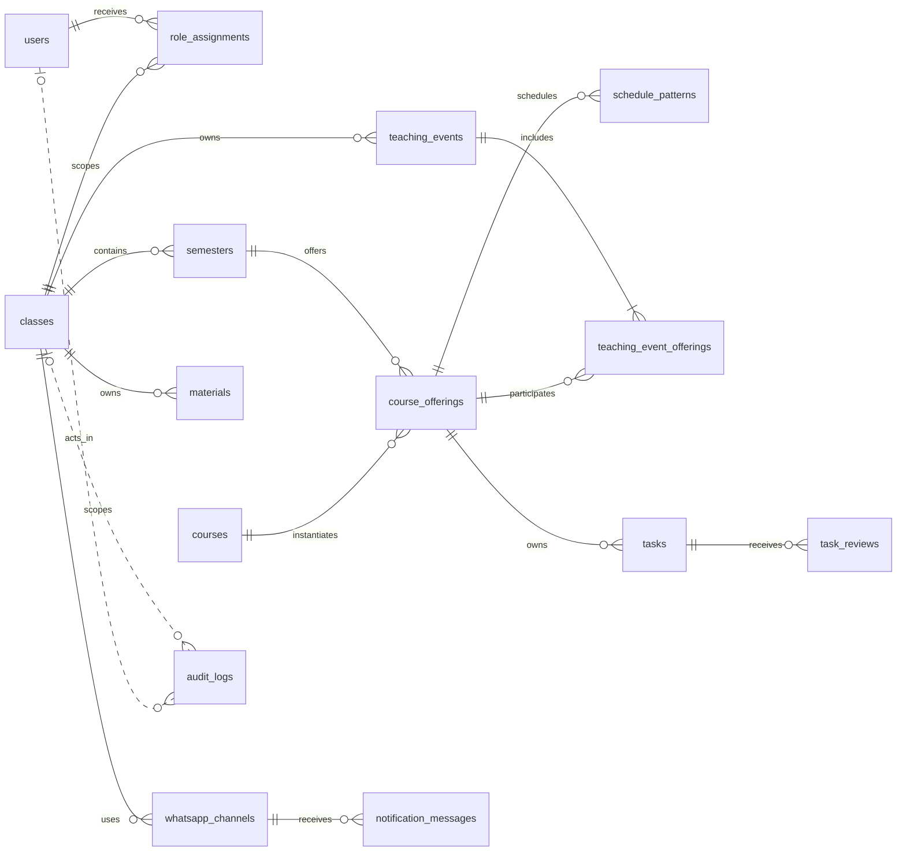
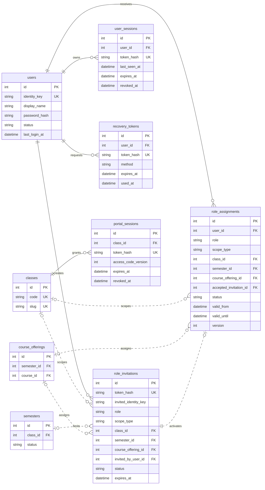
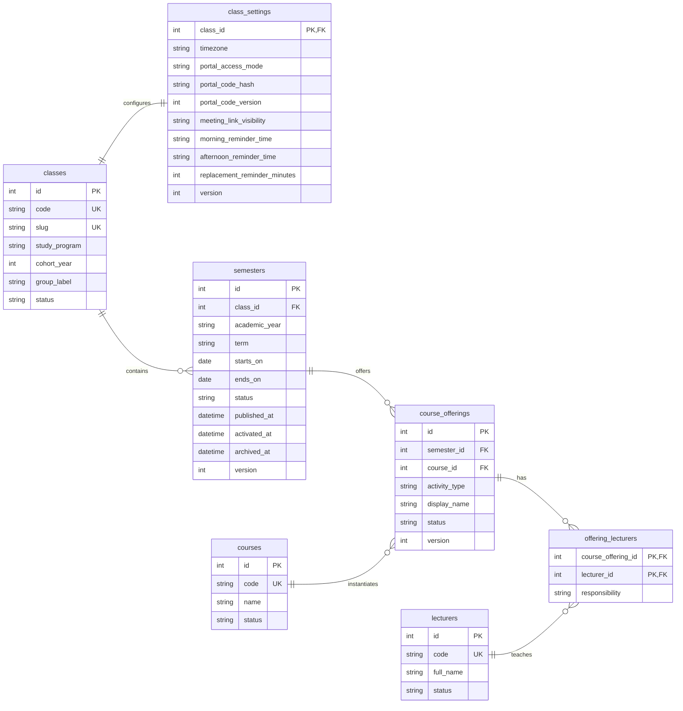
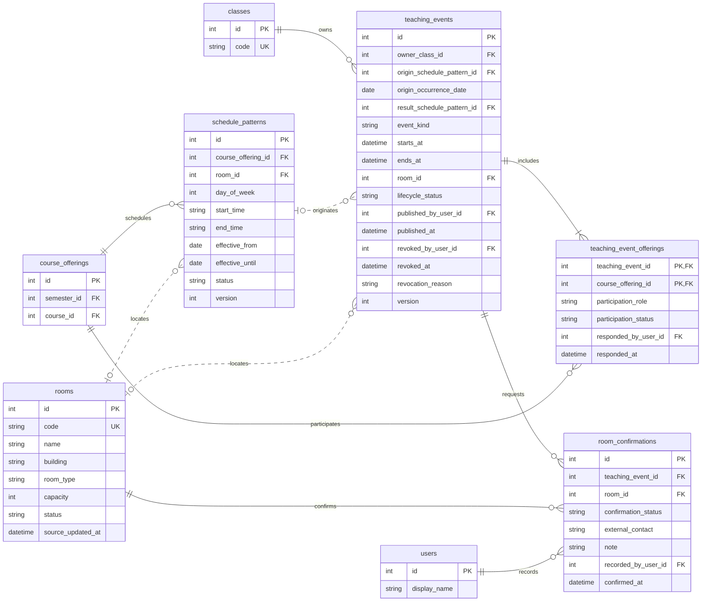
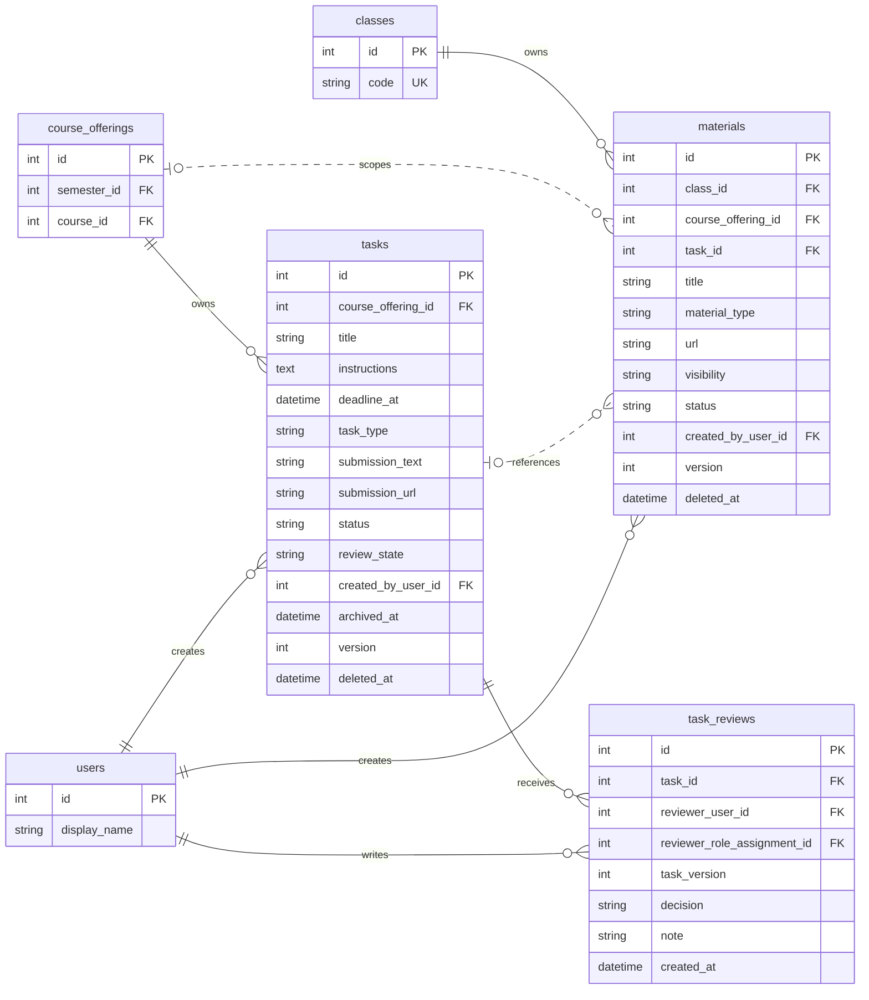
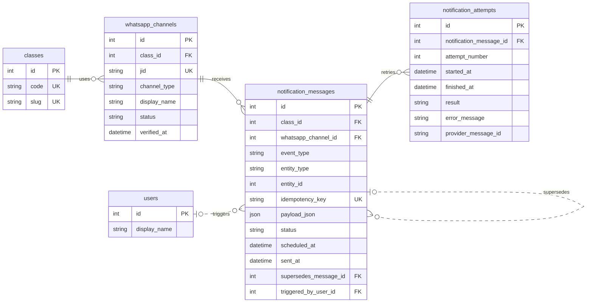
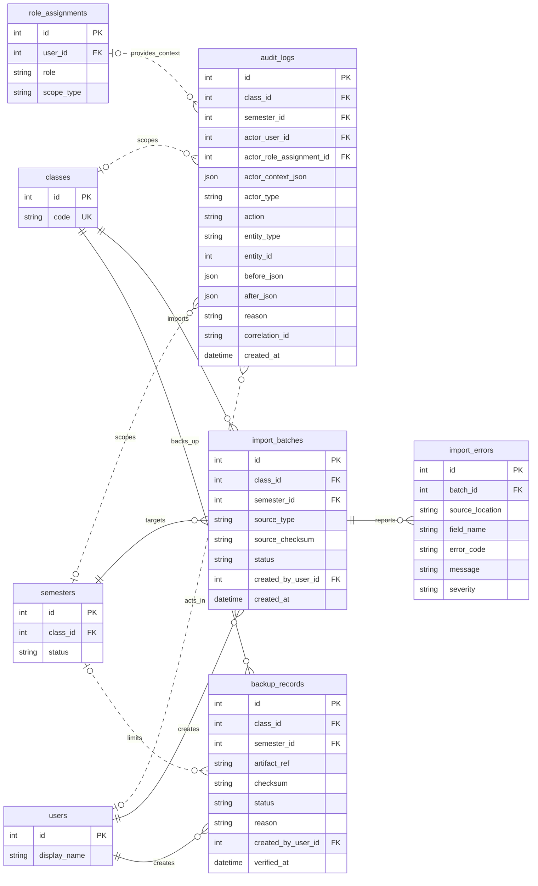

# Entity Relationship Diagram Bot Jadwal

## Status Dokumen

| Atribut | Nilai |
|---|---|
| Versi | 2.0.0 |
| Status | Approved |
| Pemilik | Tim Bot Jadwal |
| Terakhir diperbarui | 23 September 2026 |
| Model sumber | [Data Model](DATA_MODEL.md) |

Dokumen ini memvisualisasikan target logical data model Bot Jadwal. Diagram dapat dirender pada Markdown yang mendukung Mermaid atau disalin ke [Mermaid Live Editor](https://mermaid.live). Detail constraint, status, indeks, dan strategi migrasi tetap mengikuti `DATA_MODEL.md`.

## 1. Legenda

| Notasi | Arti |
|---|---|
| `PK` | Primary key |
| `FK` | Foreign key |
| `UK` | Unique key |
| Garis penuh | Relasi utama atau identifying |
| Garis putus-putus | Relasi opsional, lemah, atau referensi logis |
| `||` | Tepat satu |
| `o|` | Nol atau satu |
| `|{` | Satu atau lebih |
| `o{` | Nol atau lebih |

Kolom audit umum seperti `created_at`, `updated_at`, `deleted_at`, dan `version` tidak selalu ditampilkan agar diagram tetap terbaca.

## 2. Overview Domain

Diagram ini menunjukkan tulang punggung model tanpa seluruh atribut.

## 3. Identitas dan Akses

Aturan scope:

- `SYSTEM_ADMIN` memakai scope `GLOBAL` tanpa foreign key kelas.
- `KM` memakai scope `CLASS`; masa jabatan memakai `valid_from` dan `valid_until`, bukan `semester_id`.
- `PJ` memakai scope `COURSE_OFFERING` dan wajib memiliki kelas, semester, serta offering yang konsisten.
- Undangan memakai `PENDING`, `ACCEPTED`, `EXPIRED`, atau `REVOKED`; role assignment terpisah memakai `ACTIVE`, `SUSPENDED`, atau `REVOKED`.

## 4. Struktur Akademik

Satu kelas hanya memiliki satu semester `ACTIVE`. Teori dan praktikum dapat menjadi course offering berbeda agar jadwal, dosen, serta PJ dapat dikelola secara terpisah.

## 5. Jadwal dan Ruangan

`event_kind` memakai `REPLACEMENT`, `EXTRA`, `HOLIDAY`, atau `SESSION_CANCELLED`. Lifecycle publikasi memakai `DRAFT`, `PUBLISHED`, atau `REVOKED`. Setiap event memiliki satu offering pemilik; offering peserta baru terlihat setelah KM kelasnya menerima partisipasi. Konfirmasi TU terikat pada event draf dan tetap dilakukan di luar aplikasi.

## 6. Tugas dan Materi

Pengarsipan tugas memakai `archived_at` dan tidak mengganti status hasil. Review KM tersimpan append-only pada `task_reviews`. Materi selalu memiliki kelas; `course_offering_id` dan `task_id` bersifat opsional untuk materi umum.

## 7. WhatsApp dan Notifikasi

Data akademik dimiliki kelas, bukan JID. Koneksi WhatsApp yang putus hanya mengubah kanal dan status pesan. `idempotency_key` mencegah satu kejadian bisnis menghasilkan pesan ganda.

## 8. Audit, Impor, dan Backup

Audit log bersifat append-only. Relasi `entity_type` dan `entity_id` adalah referensi logis agar satu audit log dapat mencatat banyak jenis objek. Snapshot tidak boleh menyimpan password, token, kode portal, atau rahasia sesi.

## 9. Batas Diagram

ERD tidak menggambarkan seluruh aturan berikut karena aturan tersebut ditegakkan melalui constraint dan service:

- Hanya satu semester aktif per kelas.
- Kesesuaian kelas dan semester pada role assignment PJ.
- Tepat satu offering pemilik pada setiap teaching event dan penerimaan KM untuk kelas peserta.
- Pemisahan `SESSION_CANCELLED` dari lifecycle publikasi `REVOKED`.
- Validasi transisi status.
- Optimistic locking melalui `version`.
- Soft delete dan kebijakan retensi.
- Foreign key polimorfik pada notifikasi dan audit.
- Transaksi aktivasi semester, publikasi, pembatalan, impor, dan restore.

Rincian lengkapnya tersedia pada [Data Model](DATA_MODEL.md), [Business Rules](BUSINESS_RULES.md), dan [Functional Requirements](FUNCTIONAL_REQUIREMENTS.md).

## 10. Cara Menggunakan

1. Buka bagian diagram yang ingin ditinjau.
2. Salin isi di antara `erDiagram` dan penutup code block.
3. Tempelkan ke Mermaid Live Editor jika preview Markdown tidak merender Mermaid.
4. Ekspor sebagai SVG untuk dokumentasi atau Figma.
5. Ubah sumber Mermaid dalam repository lebih dahulu agar diagram hasil ekspor tidak menjadi sumber kebenaran terpisah.

## 11. Changelog

### 2.0.0, 23 September 2026

- Menambah sesi portal dan memisahkan undangan dari role assignment.
- Mengganti jadwal lama dengan pola, teaching event, dan junction lintas kelas.
- Menambah task review, materi umum kelas, batas semester, dan konteks role pada audit.
