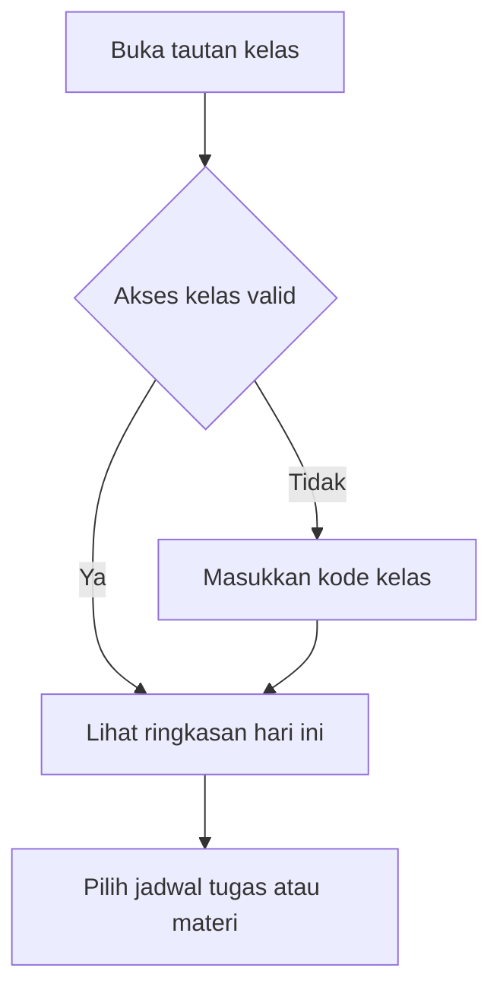
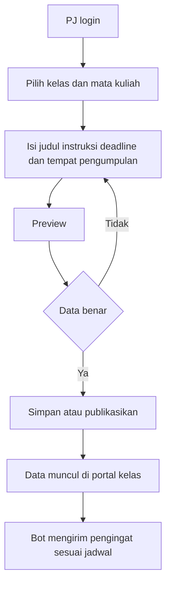
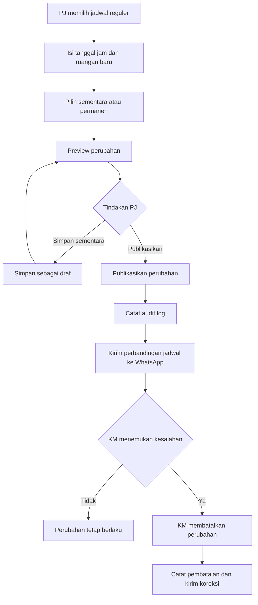
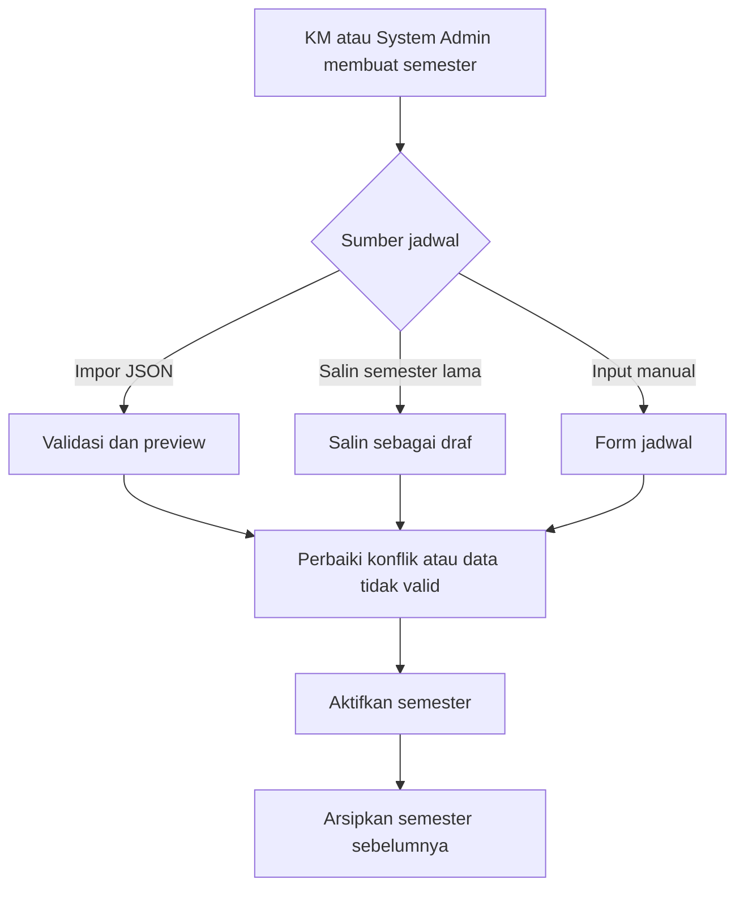
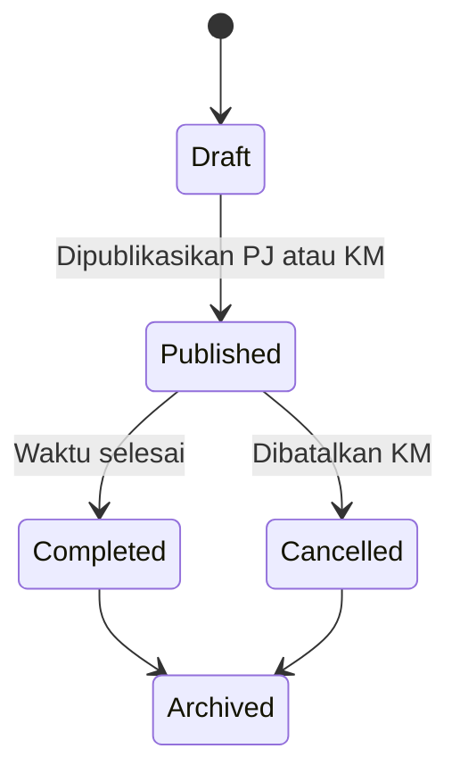
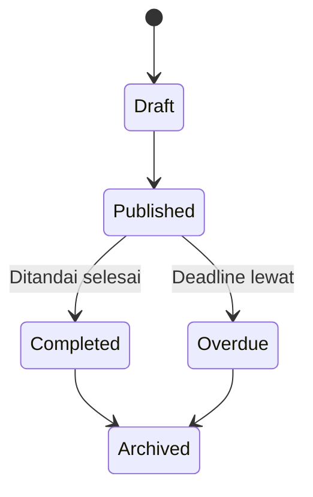

# Product Definition Bot Jadwal

## Status Dokumen

| Atribut | Nilai |
|---|---|
| Versi | 0.3 |
| Status | Approved |
| Pemilik | Tim Bot Jadwal |
| Terakhir diperbarui | 23 September 2026 |
| Sumber utama | Wawancara 11 pengguna, PRD, dan implementasi saat ini |

Dokumen ini mendefinisikan arah produk, aktor, akses, struktur kelas, alur utama, dan aturan bisnis Bot Jadwal. Baseline versi 0.3 telah disetujui, tetapi dokumen tetap bersifat hidup dan dapat diperbarui melalui Git. Status `Proposed` digunakan untuk usulan baru yang belum disetujui. Status `Approved` diberikan setelah keputusan dibahas dan diterima tim.

## 1. Latar Belakang

Bot Jadwal membantu mahasiswa menerima jadwal kuliah, perubahan jadwal, tugas, tautan, dan pengingat melalui WhatsApp. Implementasi saat ini masih banyak bergantung pada command. Hasil [wawancara pengguna](../user-interviews/README.md) menunjukkan bahwa keluaran bot umumnya mudah dibaca, tetapi proses memasukkan dan memperbarui data melalui command sulit diingat, rawan salah format, dan menambah kepadatan percakapan grup.

Arah produk yang diusulkan membagi tanggung jawab sistem:

- Dashboard web menjadi tempat melihat dan mengelola data.
- Backend Go dan SQLite menjadi sumber data utama.
- Bot WhatsApp menjadi kanal siaran, pengingat, dan jalur darurat.

## 2. Tujuan Produk

1. Memudahkan PJ dan KM memperbarui jadwal atau tugas dari ponsel tanpa menghafal command.
2. Memberikan satu sumber informasi untuk jadwal, tugas, kelas pengganti, ruangan, dan tautan materi.
3. Memisahkan data antar kelas dan semester dengan jelas.
4. Membatasi perubahan data berdasarkan peran dan mata kuliah.
5. Mengirimkan informasi WhatsApp yang ringkas, tepat waktu, dan tidak berulang.
6. Menyimpan riwayat perubahan agar kesalahan dapat ditelusuri dan dipulihkan.

## 3. Batasan Produk

Bot Jadwal bukan Learning Management System. Sistem tidak mengelola nilai, mengumpulkan berkas tugas mahasiswa, membuat kelompok, atau menggantikan Microsoft Teams dan Google Classroom. Sistem hanya menyimpan metadata tugas dan tautan pengumpulan.

Rekomendasi ruangan kosong hanya memakai data internal dan tidak menggantikan persetujuan Tata Usaha. Sistem juga tidak menjamin bahwa ruangan benar-benar tersedia jika data kampus belum lengkap atau belum diperbarui.

## 4. Prinsip Produk

- Informasi kelas harus dapat dibaca lebih cepat daripada mencarinya di riwayat WhatsApp.
- Operasi umum PJ harus dapat diselesaikan dari ponsel dalam kurang dari 30 detik.
- Perubahan tentatif tidak boleh langsung disiarkan.
- Jadwal sementara tidak boleh merusak jadwal reguler.
- Hak akses diperiksa oleh backend, bukan hanya disembunyikan di antarmuka.
- Data lama diarsipkan dan tidak ditimpa saat semester berganti.
- Tindakan penting harus dapat ditelusuri melalui audit log.

## 5. Aktor dan Tanggung Jawab

### 5.1 Mahasiswa

Mahasiswa melihat jadwal, tugas, perubahan terbaru, ruangan, dan tautan yang diizinkan. Mahasiswa tidak dapat mengubah data.

### 5.2 PJ Mata Kuliah

PJ mengelola tugas, tautan, dan perubahan jadwal untuk mata kuliah yang ditugaskan pada semester tertentu. PJ dapat langsung memublikasikan perubahan tersebut dan setiap tindakan dicatat. Satu mata kuliah dapat memiliki lebih dari satu PJ.

### 5.3 Ketua Murid

Ketua Murid atau KM mengelola seluruh mata kuliah dalam kelasnya, menunjuk PJ, memantau perubahan penting, membatalkan publikasi yang keliru, mengaktifkan semester, dan menangani koreksi data kelas.

### 5.4 System Admin

System Admin mengelola konfigurasi lintas kelas, membuat kelas, menunjuk KM awal, mengelola master ruangan, menangani pemulihan akses, serta memantau kesehatan sistem. System Admin tidak mengambil alih pekerjaan harian KM kecuali untuk dukungan atau pemulihan.

## 6. Model Akses

### 6.1 Keputusan Akses

| Keputusan | Status | Ketentuan |
|---|---|---|
| Akses mahasiswa | Approved | Tanpa akun melalui tautan atau kode kelas, hanya-baca |
| Akses PJ dan KM | Approved | Login wajib melalui akun yang diundang |
| Akses System Admin | Approved | Login wajib dengan autentikasi lebih kuat |
| Verifikasi WhatsApp | Approved | Metode verifikasi atau pemulihan, bukan satu-satunya cara login |

Halaman kelas dapat menggunakan alamat seperti `/c/d4-ti-2024-a`. Jika informasi kelas perlu dibatasi, sistem memberikan kode undangan yang disimpan di browser. Tautan rapat, nomor telepon, audit log, dan fungsi administrasi tidak ditampilkan pada halaman publik biasa.

### 6.2 Matriks Akses

| Aksi | Mahasiswa | PJ | KM | System Admin |
|---|:---:|:---:|:---:|:---:|
| Melihat jadwal dan tugas | Ya | Ya | Ya | Ya |
| Menambah dan mengubah tugas | Tidak | Mata kuliah sendiri | Semua mata kuliah pada kelas yang dikelola | Dukungan |
| Mengusulkan perubahan jadwal | Tidak | Mata kuliah sendiri | Semua mata kuliah pada kelas yang dikelola | Dukungan |
| Menerbitkan perubahan penting | Tidak | Mata kuliah sendiri | Semua mata kuliah pada kelas yang dikelola | Dukungan |
| Menunjuk PJ | Tidak | Tidak | Ya | Ya |
| Membuat kelas | Tidak | Tidak | Tidak | Ya |
| Membuat semester | Tidak | Tidak | Ya | Ya |
| Mengelola master ruangan | Tidak | Tidak | Terbatas | Ya |
| Melihat audit log | Tidak | Lingkup sendiri | Kelas yang dikelola | Semua kelas |

## 7. Struktur Kelas dan Semester

Identitas kelas tidak boleh bergantung pada semester. Contoh identitas permanen adalah `D4-TI-2024-A`, yang terdiri dari program studi, tahun angkatan, dan rombel.

```text
Program Studi
└── Kelas Permanen
    └── Semester Kelas
        ├── Penawaran Mata Kuliah
        │   ├── Dosen
        │   └── Penugasan PJ
        ├── Jadwal Reguler
        ├── Perubahan Jadwal
        ├── Tugas
        └── Tautan Materi
```

Satu kelas hanya boleh memiliki satu semester aktif. Semester lama tetap tersedia sebagai arsip hanya-baca. Mata kuliah, PJ, jadwal, dan tugas selalu terikat pada kelas serta semester agar data tidak bercampur.

## 8. Struktur Informasi Aplikasi

```text
Portal Kelas
├── Ringkasan
├── Jadwal
├── Tugas
├── Materi dan Tautan
└── Perubahan Terbaru

Area Pengelola
├── Kelola Jadwal
├── Kelola Tugas
├── Draf dan Persetujuan
├── Ruangan
├── Anggota dan Peran
└── Riwayat Perubahan

System Admin
├── Daftar Kelas
├── Semester
├── Pengguna
├── Master Mata Kuliah
├── Master Ruangan
└── Status Sistem
```

## 9. Alur Utama

### 9.1 Mahasiswa Melihat Informasi



### 9.2 PJ Menambahkan Tugas



Rekomendasi awal: PJ dapat langsung memublikasikan tugas untuk mata kuliahnya. Persetujuan KM hanya diperlukan jika kelas mengaktifkan kebijakan approval tugas.

### 9.3 Perubahan Jadwal



PJ dapat langsung memublikasikan perubahan untuk mata kuliah yang ditugaskan kepadanya. Setiap publikasi wajib masuk audit log. KM dapat membatalkan perubahan untuk seluruh mata kuliah pada kelas yang dikelolanya. Pembatalan tidak menghapus riwayat dan harus mengirimkan koreksi apabila perubahan sebelumnya sudah disiarkan.

### 9.4 Pergantian Semester



JSON menjadi format impor massal, bukan sumber data utama setelah impor. Jadwal reguler harus dapat ditambah dan diubah secara manual melalui dashboard.

## 10. Aturan Bisnis

Ketentuan rinci, transisi status, serta penanganan kegagalan dijelaskan dalam [Business Rules v1.0](BUSINESS_RULES.md). Tabel berikut tetap menjadi baseline keputusan produk yang telah disetujui.

| ID | Aturan | Status |
|---|---|---|
| BR-ACCESS-001 | Semua perubahan data memerlukan pengguna terautentikasi. | Approved |
| BR-ACCESS-002 | PJ hanya dapat mengubah mata kuliah yang ditugaskan kepadanya. | Approved |
| BR-ACCESS-003 | Pencabutan peran langsung menghentikan akses perubahan data. | Approved |
| BR-ACCESS-004 | Satu akun dapat memiliki peran berbeda pada beberapa kelas dan semester. | Approved |
| BR-CLASS-001 | Setiap data operasional wajib memiliki `class_id`. | Approved |
| BR-SEM-001 | Setiap jadwal dan tugas wajib memiliki `semester_id`. | Approved |
| BR-SEM-002 | Satu kelas hanya memiliki satu semester aktif. | Approved |
| BR-SEM-003 | Aktivasi semester baru mengarsipkan semester aktif sebelumnya. | Approved |
| BR-SEM-004 | Semester hanya dapat diaktifkan oleh KM pada kelasnya atau System Admin. | Approved |
| BR-SCH-001 | Jadwal sementara tidak mengubah jadwal reguler secara permanen. | Approved |
| BR-SCH-002 | Perubahan jadwal penting harus melalui preview sebelum publikasi. | Approved |
| BR-SCH-003 | Publikasi ulang tidak boleh mengirim notifikasi ganda. | Approved |
| BR-SCH-004 | PJ dapat memublikasikan perubahan jadwal untuk mata kuliah yang ditugaskan kepadanya. | Approved |
| BR-SCH-005 | KM dapat membatalkan perubahan jadwal pada kelas yang dikelolanya tanpa menghapus riwayat publikasi. | Approved |
| BR-SCH-006 | Pembatalan perubahan yang sudah disiarkan wajib dicatat dan diikuti notifikasi koreksi. | Approved |
| BR-TASK-001 | Tugas wajib memiliki mata kuliah, judul, deadline, dan tempat pengumpulan. | Approved |
| BR-TASK-002 | Tugas terlewat tidak dihapus otomatis, tetapi dipindahkan ke arsip. | Approved |
| BR-TASK-003 | PJ dapat memublikasikan tugas pada mata kuliahnya tanpa persetujuan KM, kecuali kelas mengaktifkan kebijakan approval. | Approved |
| BR-AUDIT-001 | Tambah, ubah, hapus, publikasi, dan perubahan peran dicatat. | Approved |
| BR-AUDIT-002 | Audit log dan arsip disimpan selama kelas aktif ditambah sekurangnya satu tahun akademik. | Approved |
| BR-ROOM-001 | Status ruangan kosong merupakan rekomendasi internal yang perlu dikonfirmasi ke TU. | Approved |
| BR-ROOM-002 | Master ruangan lintas kelas dikelola System Admin dengan masukan dari KM. | Approved |

## 11. Status Data

### 11.1 Perubahan Jadwal



### 11.2 Tugas



## 12. Notifikasi WhatsApp

Jenis notifikasi yang direncanakan:

1. Jadwal harian pada pagi hari.
2. Pengingat tugas pada sore hari.
3. Notifikasi instan setelah perubahan jadwal dipublikasikan.
4. Pengingat sebelum kelas pengganti dimulai.
5. Pemberitahuan koreksi jika data yang sudah disiarkan berubah.

Pesan perubahan jadwal menampilkan data sebelum dan sesudah. Pesan tugas hanya memuat mata kuliah, judul, deadline, dan tautan detail. Jika bot offline, notifikasi masuk antrean dengan identitas unik agar tidak terkirim dua kali setelah koneksi pulih.

## 13. Kondisi Khusus

- Dua pengurus mengedit data yang sama. Sistem harus mendeteksi versi lama sebelum menyimpan.
- PJ diganti di tengah semester. Data tetap tersimpan, tetapi akses PJ lama dicabut.
- Satu mata kuliah memiliki dua PJ. Keduanya berbagi cakupan yang sama dan setiap perubahan mencatat pelakunya.
- Satu perkuliahan diikuti beberapa kelas. Jadwal dapat terhubung ke lebih dari satu kelas tanpa menduplikasi kegiatan.
- Bot offline saat publikasi. Data tetap terbit di web dan notifikasi menunggu di antrean.
- Jadwal pengganti dibatalkan. Sistem mengirim koreksi dan mempertahankan riwayat.
- Impor JSON tidak valid. Sistem menolak aktivasi, menampilkan baris bermasalah, dan tidak menulis sebagian data tanpa konfirmasi.
- KM kehilangan akses. System Admin dapat melakukan pemulihan yang tercatat dalam audit log.
- Ruangan tampak kosong tetapi dipakai kegiatan di luar sistem. Antarmuka harus menampilkan keterbatasan data dan kebutuhan konfirmasi TU.
- Penghapusan tidak disengaja. Data penting menggunakan soft delete dan dapat dipulihkan oleh peran yang berwenang.

## 14. Keputusan atas Pertanyaan Terbuka

| ID | Pertanyaan | Keputusan | Status |
|---|---|---|---|
| OQ-001 | Apakah portal mahasiswa benar-benar publik? | Gunakan tautan atau kode kelas tanpa akun. | Approved |
| OQ-002 | Bagaimana metode login pengurus? | Akun undangan dengan kata sandi, WhatsApp untuk verifikasi atau pemulihan. | Approved |
| OQ-003 | Apakah semua tugas memerlukan persetujuan KM? | Tidak secara default; jadikan kebijakan per kelas. | Approved |
| OQ-004 | Siapa yang boleh mengaktifkan semester? | KM dan System Admin. | Approved |
| OQ-005 | Apakah PJ boleh memublikasikan perubahan jadwal? | Ya, untuk mata kuliah yang ditugaskan. Publikasi dicatat dan KM dapat membatalkannya. | Approved |
| OQ-006 | Apakah mahasiswa dapat menandai tugas selesai secara pribadi? | Tunda sampai ada akun mahasiswa. | Approved |
| OQ-007 | Apakah tautan rapat ditampilkan tanpa login? | Hanya melalui akses kelas yang valid. | Approved |
| OQ-008 | Berapa lama audit log dan arsip disimpan? | Minimal selama kelas masih aktif ditambah satu tahun akademik. | Approved |
| OQ-009 | Apakah satu akun dapat menjadi KM atau PJ di beberapa kelas? | Ya, dengan peran terpisah per kelas dan semester. | Approved |
| OQ-010 | Siapa yang mengelola data ruangan lintas kelas? | System Admin, dengan masukan dari KM. | Approved |

## 15. Ukuran Keberhasilan Awal

- PJ dapat membuat tugas dari ponsel tanpa command.
- Waktu median untuk menambahkan tugas kurang dari 30 detik.
- Jadwal pengganti tampil di web dan siaran bot pada hari pelaksanaan.
- Tidak ada perubahan data lintas kelas tanpa izin.
- Pergantian semester tidak menghapus data semester sebelumnya.
- Notifikasi publikasi tidak terkirim ganda.
- Setiap perubahan penting memiliki pelaku, waktu, data sebelum, dan data sesudah.

## 16. Pengelolaan Perubahan Dokumen

Setiap requirement, aturan, pertanyaan, dan keputusan memakai ID permanen. Item baru ditambahkan dengan ID baru dan tidak menyebabkan penomoran ulang. Keputusan lama yang berubah diberi status `Deprecated` dan menunjuk ke keputusan penggantinya.

Status yang digunakan:

- `Draft`: masih ditulis atau belum dibahas.
- `Proposed`: memiliki rekomendasi awal.
- `Approved`: telah disepakati.
- `Implemented`: sudah tersedia dan terverifikasi di aplikasi.
- `Deprecated`: tidak lagi berlaku tetapi tetap disimpan sebagai riwayat.

Perubahan besar pada akses, struktur kelas, status data, dan aturan publikasi harus mencantumkan dampaknya terhadap PRD, data model, API, migrasi, dan pengujian.
