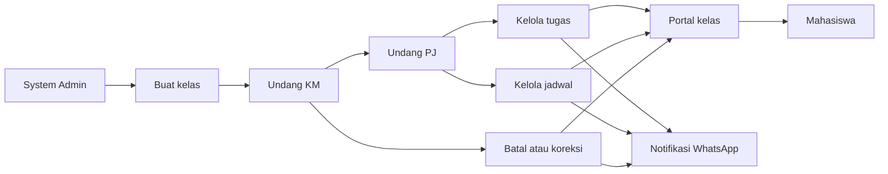

# User Flows Bot Jadwal

## Status Dokumen

| Atribut | Nilai |
|---|---|
| Versi | 2.0.0 |
| Status | Approved |
| Pemilik | Tim Bot Jadwal |
| Terakhir diperbarui | 23 September 2026 |
| Acuan produk | [Product Definition](PRODUCT_DEFINITION.md) |
| Acuan kebutuhan | [User Requirements](USER_REQUIREMENTS.md) |
| Acuan akses | [Access Control](ACCESS_CONTROL.md) |
| Acuan aturan | [Business Rules](BUSINESS_RULES.md) |
| Acuan fitur | [PRD](../PRD.md) |
| Turunan sistem | [Functional Requirements](FUNCTIONAL_REQUIREMENTS.md) |

Dokumen ini menjelaskan langkah pengguna mencapai tujuan, termasuk alur alternatif, kondisi gagal, dan hasil akhir. User flow tidak menentukan detail tampilan akhir. Nama halaman dan kontrol dapat disesuaikan pada Information Architecture dan wireframe selama hasil serta aturan akses tetap sama.

## 1. Konvensi

- `UF-ACCESS`: akun, undangan, login, dan pergantian peran.
- `UF-PORTAL`: akses hanya-baca mahasiswa.
- `UF-TASK`: pembuatan dan pengelolaan tugas.
- `UF-SCH`: jadwal reguler dan perubahan jadwal.
- `UF-SEM`: pergantian semester dan impor data.
- `UF-ROOM`: rekomendasi ruangan.
- `UF-OPS`: antrean, konflik, backup, dan pemulihan.

Setiap flow menggunakan bagian berikut:

- **Aktor:** pengguna utama yang menjalankan alur.
- **Prasyarat:** kondisi sebelum alur dapat dimulai.
- **Pemicu:** kejadian yang memulai alur.
- **Alur utama:** jalur keberhasilan yang diharapkan.
- **Alternatif dan kegagalan:** cabang yang harus ditangani.
- **Hasil:** keadaan setelah alur selesai.

## 2. Peta Alur Utama

## 3. Akses dan Akun

### UF-ACCESS-001 System Admin Membuat Kelas dan Mengundang KM

**Aktor:** System Admin  
**Prasyarat:** System Admin sudah login.  
**Pemicu:** Kelas baru akan mulai menggunakan Bot Jadwal.  
**Requirement:** UR-ACCESS-002, UR-ACCESS-004, UR-CLASS-001

**Alur utama:**

1. System Admin membuka daftar kelas dan memilih `Buat Kelas`.
2. System Admin mengisi program studi, angkatan, rombel, nama tampilan, serta mode akses portal.
3. Sistem memeriksa apakah identitas kelas sudah digunakan.
4. System Admin menyimpan kelas.
5. System Admin memilih `Undang KM` dan memasukkan identitas calon KM.
6. Sistem membuat undangan sekali pakai.
7. Calon KM membuka undangan, memverifikasi identitas, dan membuat akun atau login ke akun yang sudah ada.
8. Sistem mengaktifkan penugasan KM pada kelas.
9. Sistem mencatat pembuatan kelas dan penugasan KM.

**Alternatif dan kegagalan:**

- Jika identitas kelas sudah ada, sistem menawarkan membuka kelas tersebut dan tidak membuat duplikat.
- Jika undangan kedaluwarsa, System Admin dapat mengirim ulang. Token lama dibatalkan.
- Jika identitas calon KM salah, System Admin mencabut undangan sebelum digunakan.

**Hasil:** Kelas tersedia dan memiliki sekurangnya satu KM aktif.

### UF-ACCESS-002 KM Mengundang PJ Baru

**Aktor:** KM  
**Prasyarat:** KM aktif pada kelas; semester dan mata kuliah sudah tersedia.  
**Pemicu:** Sebuah mata kuliah membutuhkan PJ.  
**Requirement:** UR-ACCESS-002, UR-ACCESS-003

**Alur utama:**

1. KM membuka `Anggota dan Peran`.
2. KM memilih semester dan mata kuliah.
3. KM memilih `Undang PJ` dan memasukkan identitas calon PJ.
4. Sistem menampilkan cakupan akses yang akan diberikan.
5. KM mengonfirmasi undangan.
6. Calon PJ membuka tautan undangan.
7. Calon PJ mengisi nama dan membuat kata sandi.
8. Sistem mengaktifkan akun dan penugasan PJ.
9. PJ diarahkan ke dashboard dengan konteks kelas, semester, dan mata kuliah tersebut.

**Alternatif dan kegagalan:**

- Calon PJ tidak dapat mengganti kelas, semester, mata kuliah, atau peran dari halaman undangan.
- Undangan yang digunakan, dicabut, atau kedaluwarsa tidak dapat digunakan kembali.
- Jika KM kehilangan peran sebelum undangan diterima, sistem meminta KM aktif atau System Admin meninjau undangan.

**Hasil:** PJ memiliki akun dan hanya dapat mengelola mata kuliah yang ditugaskan.

### UF-ACCESS-003 Pengguna Lama Menerima Penugasan Tambahan

**Aktor:** PJ atau KM yang sudah memiliki akun  
**Prasyarat:** Undangan baru cocok dengan identitas akun yang sudah ada.  
**Pemicu:** Pengguna membuka undangan tambahan.  
**Requirement:** UR-ACCESS-005

**Alur utama:**

1. Pengguna membuka undangan.
2. Sistem meminta pengguna login.
3. Sistem menampilkan peran dan cakupan baru.
4. Pengguna mengonfirmasi penerimaan.
5. Sistem menambahkan role assignment tanpa membuat akun baru.
6. Sistem menampilkan pilihan konteks yang sekarang tersedia.

**Alternatif dan kegagalan:**

- Jika login menggunakan identitas berbeda, sistem menolak pengaitan dan meminta akun yang sesuai.
- Jika penugasan yang sama sudah aktif, sistem menampilkan bahwa akses telah tersedia.

**Hasil:** Satu akun memiliki beberapa peran atau cakupan yang terpisah.

### UF-ACCESS-004 Pengurus Login dan Memilih Konteks

**Aktor:** PJ, KM, atau System Admin  
**Prasyarat:** Akun aktif.  
**Pemicu:** Pengguna membuka halaman login.  
**Requirement:** UR-ACCESS-002, UR-ACCESS-005

**Alur utama:**

1. Pengguna memasukkan identitas akun dan kata sandi.
2. Sistem memverifikasi akun dan membuat sesi.
3. Sistem mengambil seluruh role assignment aktif.
4. Jika hanya ada satu konteks, sistem membuka dashboard konteks tersebut.
5. Jika ada beberapa konteks, sistem meminta pengguna memilih peran, kelas, dan semester.
6. Dashboard menampilkan konteks aktif secara jelas.
7. Pengguna dapat berpindah konteks tanpa logout.

**Alternatif dan kegagalan:**

- Kredensial salah menghasilkan pesan umum tanpa mengungkap apakah akun terdaftar.
- Akun ditangguhkan atau seluruh peran dicabut tidak dapat membuka area pengelola.
- Bot WhatsApp offline tidak menghalangi login dengan kata sandi.

**Hasil:** Pengguna masuk dengan izin sesuai konteks yang dipilih.

### UF-ACCESS-005 Pengurus Memulihkan Akun

**Aktor:** PJ, KM, atau System Admin  
**Prasyarat:** Akun pernah aktif.  
**Pemicu:** Pengguna lupa kata sandi atau kehilangan akses.  
**Requirement:** UR-ACCESS-006

**Alur utama:**

1. Pengguna memilih `Lupa Kata Sandi`.
2. Pengguna memasukkan identitas akun.
3. Sistem mengirim verifikasi WhatsApp atau meminta kode pemulihan.
4. Pengguna menyelesaikan verifikasi.
5. Pengguna membuat kata sandi baru.
6. Sistem mencabut sesi lama dan mencatat pemulihan.

**Alternatif dan kegagalan:**

- Jika bot offline, pengguna dapat memakai kode pemulihan atau menghubungi System Admin.
- Pemulihan manual oleh System Admin memerlukan verifikasi identitas dan alasan yang dicatat.
- Token pemulihan kedaluwarsa atau yang sudah digunakan ditolak.

**Hasil:** Pengguna mendapatkan kembali akses tanpa kehilangan data atau peran.

### UF-ACCESS-006 Mengganti PJ atau KM

**Aktor:** KM untuk pergantian PJ; System Admin untuk pergantian KM  
**Prasyarat:** Pengganti telah ditentukan.  
**Pemicu:** Masa tugas berakhir, pergantian semester, atau insiden akses.  
**Requirement:** UR-ACCESS-003, UR-ACCESS-004, UR-ACCESS-006

**Alur utama:**

1. Pemberi akses mengundang pengganti.
2. Pengganti mengaktifkan penugasan.
3. Pemberi akses mencabut atau menangguhkan peran lama.
4. Sistem mencabut izin perubahan pada permintaan berikutnya.
5. Sistem mempertahankan seluruh data dan audit pelaku lama.
6. Sistem mencatat pergantian peran.

**Alternatif dan kegagalan:**

- Sistem memperingatkan jika pencabutan akan membuat kelas tanpa KM aktif.
- Pada insiden keamanan, System Admin dapat menangguhkan KM lama sebelum pengganti aktif.

**Hasil:** Pengurus baru aktif dan pengurus lama tidak dapat melakukan perubahan baru.

## 4. Portal Mahasiswa

### UF-PORTAL-001 Mahasiswa Membuka Portal Kelas

**Aktor:** Mahasiswa  
**Prasyarat:** Kelas aktif dan portal dipublikasikan.  
**Pemicu:** Mahasiswa membuka tautan kelas dari WhatsApp.  
**Requirement:** UR-ACCESS-001, UR-CLASS-001

**Alur utama:**

1. Mahasiswa membuka `/c/{kelas}`.
2. Sistem memeriksa mode akses kelas.
3. Jika kelas menggunakan kode, mahasiswa memasukkan kode kelas.
4. Sistem membuat sesi portal database dengan versi kode aktif.
5. Portal membuka Ringkasan berisi jadwal hari ini, perubahan terbaru, dan tugas terdekat.

**Alternatif dan kegagalan:**

- Kode salah menampilkan pesan umum dan membatasi percobaan berulang.
- Kelas tidak aktif menampilkan informasi bahwa portal belum tersedia.
- Rotasi kode menaikkan versi dan membatalkan seluruh sesi portal lama.
- Kode kelas aktif dapat membuka semester arsip yang pernah dipublikasikan dalam mode hanya-baca.

**Hasil:** Mahasiswa melihat data kelas tanpa memperoleh akses administrasi.

### UF-PORTAL-002 Mahasiswa Melihat Jadwal dan Tugas

**Aktor:** Mahasiswa  
**Prasyarat:** Akses portal valid.  
**Pemicu:** Mahasiswa memilih Jadwal atau Tugas.  
**Requirement:** UR-SCH-001, UR-SCH-008, UR-TASK-002, UR-TASK-003

**Alur utama:**

1. Mahasiswa memilih hari atau membuka jadwal hari ini.
2. Sistem menampilkan jadwal reguler yang sudah digabung dengan perubahan aktif.
3. Label membedakan jadwal reguler, pengganti, tambahan, libur, atau dibatalkan.
4. Mahasiswa membuka daftar tugas.
5. Sistem mengelompokkan tugas menjadi Hari Ini, Minggu Ini, Mendatang, dan Terlewat.
6. Mahasiswa membuka detail tugas untuk melihat instruksi dan tempat pengumpulan.

**Alternatif dan kegagalan:**

- Data kosong menampilkan keadaan kosong yang menjelaskan bahwa belum ada jadwal atau tugas.
- Tautan sensitif hanya muncul setelah akses kelas valid.

**Hasil:** Mahasiswa memperoleh informasi terbaru tanpa menjalankan command.

## 5. Tugas

### UF-TASK-001 PJ Membuat dan Memublikasikan Tugas

**Aktor:** PJ  
**Prasyarat:** PJ login pada konteks mata kuliah aktif.  
**Pemicu:** Dosen memberikan tugas baru.  
**Requirement:** UR-TASK-001, UR-TASK-002, UR-TASK-005

**Alur utama:**

1. PJ membuka halaman Tugas dan memilih `Tambah Tugas`.
2. Mata kuliah terisi sesuai konteks atau dipilih dari cakupan PJ.
3. PJ mengisi judul, instruksi, deadline, jenis tugas, dan tempat pengumpulan.
4. Sistem memvalidasi data dan menampilkan preview.
5. PJ memilih `Publikasikan`.
6. Sistem memeriksa izin dan versi data.
7. Sistem menyimpan tugas, mencatat audit log, dan menampilkannya di portal.
8. Sistem menjadwalkan pengingat sesuai deadline.

**Alternatif dan kegagalan:**

- PJ dapat memilih `Simpan Draf` tanpa menampilkan tugas ke mahasiswa.
- Validasi gagal mempertahankan isian dan menandai kolom bermasalah.
- Jika sesi berakhir, sistem meminta login ulang tanpa menghapus isian lokal.

**Hasil:** Tugas berstatus draf atau terbit. Tugas terbit memiliki review state awal `NOT_REVIEWED`.

### UF-TASK-002 KM Mereview Tugas Terbit

**Aktor:** KM  
**Prasyarat:** Terdapat tugas yang dipublikasikan PJ pada kelas KM.
**Pemicu:** KM membuka antrean review.
**Requirement:** UR-TASK-005

**Alur utama:**

1. KM membuka detail tugas dan melihat pembuat, versi, status publikasi, serta isinya.
2. KM memilih `Setujui`, `Minta Koreksi`, atau `Batalkan`.
3. Sistem memeriksa apakah versi tugas belum berubah.
4. Sistem menambahkan riwayat review beserta pelaku, waktu, dan catatan.
5. Jika KM meminta koreksi atau membatalkan, sistem menarik tugas dari portal dan membatalkan notifikasi tertunda.

**Alternatif dan kegagalan:**

- Catatan wajib untuk `Minta Koreksi` dan `Batalkan`.
- Jika PJ mengubah tugas saat ditinjau, sistem meminta KM memuat versi terbaru.

**Hasil:** Tugas tetap terbit setelah disetujui atau kembali menjadi draf setelah publikasinya ditarik.

### UF-TASK-003 Mengubah, Mengarsipkan, dan Memulihkan Tugas

**Aktor:** PJ atau KM  
**Prasyarat:** Pengguna memiliki cakupan terhadap tugas.  
**Pemicu:** Informasi tugas berubah, selesai, atau terhapus tidak sengaja.  
**Requirement:** UR-TASK-006, UR-OPS-003

**Alur utama:**

1. Pengguna membuka detail tugas.
2. Pengguna memilih ubah, tandai selesai, arsipkan, atau hapus.
3. Sistem meminta konfirmasi untuk tindakan yang menghilangkan tugas dari daftar aktif.
4. Sistem menyimpan perubahan dan audit log.
5. Pengarsipan mengisi waktu arsip tanpa mengganti status hasil tugas.

**Alternatif dan kegagalan:**

- Data yang sudah berubah oleh pengguna lain tidak ditimpa tanpa konfirmasi.
- Tugas yang dihapus dapat dipulihkan oleh pengguna berwenang selama masa retensi.
- Perubahan deadline yang signifikan dapat memicu notifikasi pembaruan.

**Hasil:** Status tugas dan riwayatnya tetap konsisten serta dapat ditelusuri.

## 6. Jadwal

### UF-SCH-001 Membuat Jadwal Reguler Secara Manual

**Aktor:** PJ atau KM  
**Prasyarat:** Semester dan penawaran mata kuliah tersedia.  
**Pemicu:** Jadwal belum tersedia atau perlu dikoreksi.  
**Requirement:** UR-SCH-002, UR-SEM-002

**Alur utama:**

1. Pengguna membuka Kelola Jadwal.
2. Pengguna memilih mata kuliah dalam cakupannya.
3. Pengguna mengisi jenis, dosen, hari, jam mulai, durasi, dan ruangan.
4. Sistem menghitung jam selesai dan memeriksa konflik data internal.
5. Pengguna memeriksa preview.
6. Pengguna menyimpan jadwal reguler.
7. Sistem mencatat perubahan.

**Alternatif dan kegagalan:**

- Konflik jadwal atau ruangan menampilkan peringatan dan kandidat yang bertabrakan.
- PJ tidak dapat memilih mata kuliah di luar cakupannya.

**Hasil:** Jadwal reguler tersedia untuk semester aktif.

### UF-SCH-002 PJ Memublikasikan Jadwal Pengganti

**Aktor:** PJ  
**Prasyarat:** PJ memiliki mata kuliah dan jadwal reguler yang akan diubah.  
**Pemicu:** Dosen meminta kelas pengganti atau perubahan sesi.  
**Requirement:** UR-SCH-003, UR-SCH-004, UR-SCH-005, UR-SCH-006

**Alur utama:**

1. PJ memilih sesi jadwal reguler.
2. PJ memilih `Buat Perubahan`.
3. PJ menentukan jenis sementara atau permanen.
4. PJ mengisi tanggal, jam, ruangan, dan keterangan.
5. Sistem memeriksa konflik dan menampilkan preview sebelum serta sesudah.
6. PJ memilih `Publikasikan`.
7. Sistem memeriksa izin dan versi jadwal.
8. Sistem menyimpan publikasi dan audit log.
9. Portal menampilkan perubahan.
10. Sistem mengirim atau mengantrekan notifikasi komparatif.

**Alternatif dan kegagalan:**

- PJ dapat menyimpan draf untuk menunggu kepastian dosen.
- Konflik tidak selalu memblokir publikasi, tetapi memerlukan konfirmasi dan alasan sesuai business rule.
- Kegagalan WhatsApp tidak membatalkan publikasi web.
- Publikasi ulang dengan identitas sama tidak menghasilkan pesan ganda.

**Hasil:** Perubahan berlaku dan dapat ditelusuri ke PJ yang memublikasikannya.

### UF-SCH-003 Membuat Perubahan Jadwal Permanen

**Aktor:** PJ atau KM  
**Prasyarat:** Pengguna memiliki izin dan perubahan telah dipastikan.  
**Pemicu:** Jadwal rutin berubah untuk sisa semester.  
**Requirement:** UR-SCH-003, UR-SCH-005, UR-SCH-006

**Alur utama:**

1. Pengguna memilih jadwal reguler dan jenis `Permanen`.
2. Pengguna mengisi data baru serta tanggal mulai berlaku.
3. Sistem menampilkan dampak terhadap sesi berikutnya.
4. Pengguna memeriksa preview dan memublikasikan.
5. Sistem menutup versi jadwal reguler lama tanpa menghapus riwayat.
6. Sistem mengaktifkan versi baru dan mengirim notifikasi perubahan.

**Alternatif dan kegagalan:**

- Jika tanggal mulai berada pada semester tidak aktif, sistem menolak publikasi.
- Jika ada perubahan sementara yang bertabrakan, sistem meminta pengguna menyelesaikan konflik.

**Hasil:** Jadwal reguler baru berlaku sejak tanggal yang ditentukan.

### UF-SCH-004 KM Mencabut Publikasi Event

**Aktor:** KM  
**Prasyarat:** Perubahan jadwal telah dipublikasikan pada kelas KM.  
**Pemicu:** KM menemukan data keliru atau perubahan tidak lagi berlaku.  
**Requirement:** UR-SCH-007, UR-AUDIT-002

**Alur utama:**

1. KM membuka detail perubahan dan riwayat publikasinya.
2. KM memilih `Cabut Publikasi`.
3. Sistem menampilkan jadwal yang akan kembali berlaku.
4. KM memasukkan alasan dan mengonfirmasi.
5. Sistem mengubah lifecycle menjadi `REVOKED` tanpa menghapus publikasi lama.
6. Sistem mencatat pencabutan dan pelaku.
7. Portal menampilkan jadwal yang kembali berlaku.
8. Sistem mengirim atau mengantrekan notifikasi koreksi.

**Alternatif dan kegagalan:**

- Jika event sudah dicabut, sistem tidak membuat pencabutan kedua.
- Jika jadwal dasar telah berubah, sistem meminta KM memeriksa versi terbaru sebelum melanjutkan.

**Hasil:** Perubahan tidak lagi berlaku, riwayat tetap tersedia, dan mahasiswa menerima koreksi.

### UF-SCH-005 Membuat Perkuliahan Lintas Kelas

**Aktor:** KM kelas pemilik dan KM kelas peserta
**Prasyarat:** Course offering tiap kelas tersedia pada periode yang sesuai.
**Pemicu:** Perkuliahan akan dilaksanakan bersama.
**Requirement:** UR-SCH-009

**Alur utama:**

1. KM pemilik membuat teaching event dan memilih course offering milik kelasnya.
2. KM pemilik menambahkan kelas peserta yang relevan.
3. Sistem membuat partisipasi berstatus `PENDING` tanpa menduplikasi event.
4. KM peserta meninjau waktu, ruangan, mata kuliah, dan kelas pemilik.
5. KM peserta menerima partisipasi.
6. Setelah event dipublikasikan, sistem menampilkannya pada seluruh kelas dengan partisipasi `ACCEPTED`.

**Alternatif dan kegagalan:**

- KM peserta dapat menolak undangan atau melepas kelasnya kemudian.
- KM peserta tidak dapat mengubah acara utama; koreksi diajukan kepada KM pemilik.
- Event tidak muncul pada portal kelas peserta selama status masih `PENDING` atau `DECLINED`.

**Hasil:** Satu teaching event digunakan bersama tanpa salinan jadwal yang dapat berbeda.

## 7. Semester

### UF-SEM-001 Membuat Semester dengan Impor JSON

**Aktor:** KM atau System Admin  
**Prasyarat:** Kelas tersedia dan file JSON mengikuti format impor.  
**Pemicu:** Jadwal semester baru tersedia dalam berkas.  
**Requirement:** UR-SEM-001, UR-SEM-002, UR-SEM-003

**Alur utama:**

1. Pengguna memilih `Buat Semester` dan mengisi tahun akademik, periode, tanggal mulai, serta tanggal selesai.
2. Pengguna memilih `Impor JSON` dan memilih berkas.
3. Sistem memvalidasi struktur, mata kuliah, jam, dosen, ruangan, dan duplikasi.
4. Sistem menampilkan preview beserta peringatan.
5. Pengguna memperbaiki data yang tidak valid atau mengunggah ulang berkas.
6. Sistem menyimpan semester sebagai draf.
7. Pengguna meninjau mata kuliah dan jadwal.
8. Pengguna mengaktifkan semester.
9. Sistem mengarsipkan semester aktif sebelumnya dan mencatat aktivasi.

**Alternatif dan kegagalan:**

- Kesalahan yang memblokir aktivasi ditampilkan per baris dan field.
- Sistem tidak menulis sebagian data aktif ketika impor gagal.
- System Admin dapat membantu tanpa mengambil alih kepemilikan kelas.

**Hasil:** Semester baru aktif dan semester sebelumnya menjadi arsip hanya-baca.

### UF-SEM-002 Membuat Semester dengan Salin atau Input Manual

**Aktor:** KM atau System Admin  
**Prasyarat:** Kelas tersedia.  
**Pemicu:** Tidak ada JSON yang siap digunakan.  
**Requirement:** UR-SEM-001, UR-SEM-002

**Alur utama:**

1. Pengguna membuat semester sebagai draf dengan tanggal mulai dan selesai.
2. Pengguna memilih menyalin semester sebelumnya atau membuat mata kuliah manual.
3. Jika menyalin, sistem menyalin struktur sebagai draf tanpa tugas dan publikasi lama.
4. Pengguna memperbarui mata kuliah, dosen, PJ, hari, jam, dan ruangan.
5. Sistem menampilkan ringkasan serta konflik.
6. Pengguna mengaktifkan semester setelah data lengkap.
7. Sistem mengarsipkan semester sebelumnya.

**Alternatif dan kegagalan:**

- Semester tidak dapat diaktifkan jika tidak memiliki jadwal minimum yang ditetapkan.
- Penugasan PJ lama tidak otomatis aktif sebelum dikonfirmasi.

**Hasil:** Semester baru aktif dengan data yang dibuat atau disalin secara terkontrol.

## 8. Ruangan

### UF-ROOM-001 Mencari Kandidat Ruangan Kosong

**Aktor:** PJ atau KM  
**Prasyarat:** Master ruangan dan jadwal internal tersedia.  
**Pemicu:** Pengurus membutuhkan ruangan untuk kelas pengganti.  
**Requirement:** UR-ROOM-001, UR-ROOM-002

**Alur utama:**

1. Pengguna membuat teaching event draf dengan tanggal, jam mulai, dan jam selesai.
2. Sistem membandingkan penggunaan ruangan pada jadwal internal.
3. Sistem menampilkan kandidat ruangan beserta sumber dan waktu pembaruan data.
4. Pengguna memilih kandidat lalu menghubungi TU secara manual.
5. Pengguna mencatat status, nama petugas atau keterangan sumber, waktu, dan catatan konfirmasi pada draf.
6. Event dengan ruangan `CONFIRMED` dapat dilanjutkan ke preview dan publikasi.

**Alternatif dan kegagalan:**

- Jika tidak ada kandidat, sistem menampilkan konflik dan menyarankan rentang lain.
- Jika data tidak lengkap, sistem menjelaskan keterbatasannya.
- Hasil tidak pernah menyatakan ruangan pasti tersedia tanpa konfirmasi TU.

**Hasil:** Pengguna memperoleh kandidat ruangan dan catatan konfirmasi.

## 9. Operasional dan Pemulihan

### UF-OPS-001 Publikasi Saat Bot Offline

**Aktor:** Sistem, dipicu PJ atau KM  
**Prasyarat:** Data valid, tetapi koneksi WhatsApp tidak aktif.  
**Pemicu:** Pengguna memublikasikan tugas, jadwal, atau koreksi.  
**Requirement:** UR-NOTIF-005, UR-OPS-001

**Alur utama:**

1. Sistem menyimpan publikasi dan audit log dalam satu proses yang konsisten.
2. Portal langsung menampilkan data terbaru.
3. Sistem membuat notifikasi dengan identitas unik dan status menunggu.
4. Sistem menampilkan bahwa data terbit tetapi WhatsApp belum terkirim.
5. Setelah bot kembali aktif, pekerja antrean mengirim notifikasi.
6. Sistem mencatat hasil pengiriman dan menandai notifikasi selesai.

**Alternatif dan kegagalan:**

- Percobaan gagal dijadwalkan ulang tanpa membuat notifikasi baru.
- Jika isi berubah sebelum dikirim, business rule menentukan apakah pesan diganti atau dikirim sebagai koreksi.
- System Admin dapat melihat kegagalan dan mencoba ulang secara terkontrol.

**Hasil:** Publikasi web tetap berhasil dan pesan WhatsApp terkirim satu kali setelah layanan pulih.

### UF-OPS-002 Dua Pengurus Mengedit Data yang Sama

**Aktor:** PJ atau KM  
**Prasyarat:** Dua pengguna membuka versi data yang sama.  
**Pemicu:** Pengguna kedua menyimpan setelah pengguna pertama.  
**Requirement:** UR-OPS-004

**Alur utama:**

1. Pengguna pertama menyimpan perubahan.
2. Sistem menaikkan versi data dan mencatat audit log.
3. Pengguna kedua mencoba menyimpan versi lama.
4. Sistem menolak penimpaan otomatis.
5. Sistem menampilkan data terbaru dan perubahan milik pengguna kedua.
6. Pengguna kedua memilih memuat ulang, menyalin perubahan, atau membatalkan.

**Alternatif dan kegagalan:**

- Sistem tidak menggabungkan perubahan yang berpotensi konflik secara diam-diam.
- Input pengguna kedua tetap tersedia sampai pengguna mengambil keputusan.

**Hasil:** Data terbaru tidak tertimpa tanpa sepengetahuan pengguna.

### UF-OPS-003 Backup dan Pemulihan Kelas

**Aktor:** System Admin, dipicu permintaan KM atau insiden  
**Prasyarat:** Pengguna memiliki izin dan backup tersedia atau akan dibuat.  
**Pemicu:** Backup berkala, migrasi, atau pemulihan data.  
**Requirement:** UR-OPS-002, UR-OPS-003

**Alur utama:**

1. System Admin memilih kelas dan semester.
2. Sistem menampilkan cakupan data yang akan dicadangkan atau dipulihkan.
3. System Admin memasukkan alasan dan mengonfirmasi.
4. Sistem membuat backup atau menjalankan validasi paket pemulihan.
5. Sebelum pemulihan, sistem membuat titik pemulihan saat ini.
6. Sistem menjalankan pemulihan secara konsisten.
7. Sistem memverifikasi jumlah data, relasi, dan kelas tujuan.
8. Sistem mencatat tindakan serta hasilnya.

**Alternatif dan kegagalan:**

- Paket dengan kelas atau semester yang tidak cocok ditolak.
- Kegagalan pemulihan mengembalikan sistem ke keadaan sebelum proses.
- Pemulihan sesi WhatsApp tidak mengubah data akademik.

**Hasil:** Data dapat dicadangkan atau dipulihkan tanpa mencampur kelas dan tanpa kehilangan titik sebelumnya.

## 10. Ringkasan Ketertelusuran

| Kelompok Flow | User Requirement Utama | Area PRD |
|---|---|---|
| UF-ACCESS | UR-ACCESS-001 sampai UR-ACCESS-006 | Epic 1 |
| UF-PORTAL | UR-ACCESS-001, UR-SCH-001, UR-TASK-002 | Struktur Informasi |
| UF-TASK | UR-TASK-001 sampai UR-TASK-006 | Epic 4 |
| UF-SCH | UR-SCH-002 sampai UR-SCH-009 | Epic 3 |
| UF-SEM | UR-SEM-001 sampai UR-SEM-003 | Epic 2 |
| UF-ROOM | UR-ROOM-001 dan UR-ROOM-002 | Epic 6 |
| UF-OPS | UR-NOTIF-005, UR-OPS-001 sampai UR-OPS-004 | Epic 7 dan NFR |

## 11. Kriteria Selesai User Flow

Sebuah flow siap diterjemahkan menjadi desain dan implementasi ketika:

1. Aktor serta cakupan izinnya jelas.
2. Prasyarat dan hasil akhir dapat diuji.
3. Alur alternatif dan kegagalan utama sudah dicatat.
4. Status data yang berubah dapat disebutkan.
5. Requirement dan functional requirement terkait dapat dilacak.
6. Tidak ada langkah yang bergantung pada keputusan produk yang belum terdokumentasi.

Perubahan alur yang memengaruhi hak akses, status data, atau publikasi harus memperbarui Product Definition, User Requirements, Access Control, PRD, dan test case terkait.

## 12. Changelog

### 2.0.0, 23 September 2026

- Mengubah approval tugas menjadi review retrospektif dan pencabutan publikasi.
- Menambah alur perkuliahan lintas kelas dan sesi portal berbasis versi kode.
- Mengubah alur ruangan agar teaching event draf dibuat sebelum konfirmasi manual dengan TU.
